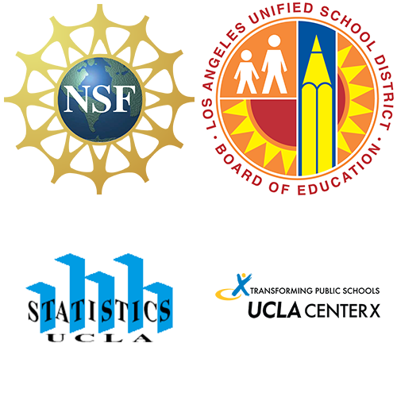

Click <a href="../index.html" target="_blank">here</a>  to open in a new tab, or save the link <a href="../index.html" target="_blank">https://curriculum.idsucla.org</a>.

# Introduction to Data Science Curriculum v_5.0

**Robert Gould**

**Suyen Machado**

**Terri Anna Johnson**

**James Molyneux**

## Sponsors & Supporters

This curriculum was created under the auspices of the National Science Foundation, Mathematics and
Science Partnership grant, "MOBILIZE: Mobilizing for Innovative Computer Science Teaching and
Learning". Lead Principal Investigator: Robert Gould (UCLA, Statistics).

## Contributing Authors
**LAUSD:** Monica Casillas and Heidi Estevez

**UCLA:** Amelia McNamara and Linda Zanontian

## Acknowledgments and Special Thanks
Co-Principal Investigators: Deborah Estrin (UCLA, CENS), Joanna Goode (University of Oregon), Mark
Hansen (UCLA, Statistics), Jane Margolis (UCLA, Center X), Thomas Philip (UCLA, Center X), Jody
Priselac (UCLA, GSEIS), Derrick Chau (LAUSD), Gerardo Loera (LAUSD) and Todd Ullah (LAUSD);
Mobilize Project Director: LeeAnn Trusela

### <u>LAUSD IDS Pilot Teachers</u>

Robert Montgomery, Carole Sailer, Joy Lee, Monica Casillas, Roberta Ross, Velia Valle, Jose Guzman, Pamela Amaya, Arlene Pascua, Christopher Marangopoulos

*This material is based upon work supported by the National Science Foundation under Grant Number
0962919.*

*Any opinions, findings, and conclusions or recommendations expressed in this material are those of the
author(s) and do not necessarily reflect the views of the National Science Foundation.*

*This work is licensed under the Creative Commons Attribution-ShareAlike 4.0 International License. To view a
copy of this license, visit [http://creativecommons.org/licenses/by-sa/4.0](http://creativecommons.org/licenses/by-sa/4.0 "http://creativecommons.org/licenses/by-sa/4.0")*

**For additional information related to IDS visit: [https://www.idsucla.org](https://www.idsucla.org "https://www.idsucla.org")**

## Mobilize

Mobilize, an innovative partnership between UCLA and LAUSD, was funded in 2010 by the
National Science Foundation to develop barrier-breaking curriculum in science, mathematics,
and computer science to teach students to think creatively, constructively, and critically about
the role of data in science and in everyday life. The Mobilize curricula center around
Participatory Sensing campaigns, through which students use their mobile devices to collect
and share data about their community and their lives, and analyze these data to gain a greater
understanding about their world. Mobilize broke barriers by teaching students to apply concepts
and practices from computer science and statistics to learning science and mathematics, and it
was uniquely dynamic in that each Mobilize class collects its own data, and each class has the
opportunity to make unique discoveries. Across all Mobilize curricula, mobile devices are used
not as gimmicks to capture students' attention, but as legitimate tools that bring scientific
enquiry into their everyday lives. Since 2011, LAUSD high school mathematics, science, and
computer science teachers have attended the summer institutes designed by the Mobilize grant
to learn to use the participatory sensing (PS) methods, tools, and materials to deepen their
knowledge of computer science (CS) concepts and to support student CS, math, and science
learning.

First implemented in 2014 under the auspices of the Mobilize grant, Introduction to Data
Science (IDS) began as a pilot program with 10 LAUSD mathematics teachers, and by the 5th
printing of the curriculum in 2018 has expanded to 30+ schools in seven Southern California
public school districts, serving over 4,000 students and counting. In addition to addressing the
Common Core State Standards (CCSS) for High School Statistics and Probability IDS leads
students to:

* understand how data are used by professionals to address real-world problems;

* understand that data are used in all facets of modern life;

* understand how data support science to identify and tackle real-world problems in our communities;

* analyze statistical graphics to identify patterns in data and to connect these patterns back to the real world;

* understand that by treating photos, words, numbers, and sounds as data, we can gain insight into the real world;

* learn to analyze data, including: posing questions that can be answered by considering relations among variables in a data set, using collected data to generate hypotheses for future data collection, critically evaluating shortcomings and strengths in the data and the data collection process, and informally evaluating hypotheses using data at hand. 
