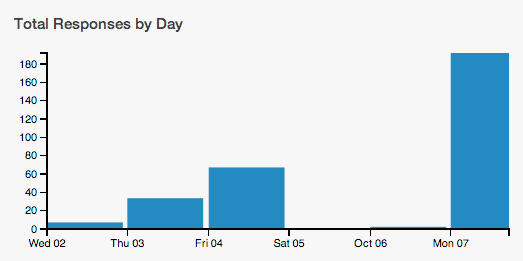

##**Campaign Guidelines – Food Habits**

###**1. The Issue:**

Childhood obesity is a major problem in the U.S. Many have called for food producers to provide
consumers with nutritional information so that they can make wiser choices. This raises some
interesting questions:

1) What is my snacking pattern?

2) How good am I at rating the healthiness of my snack?

3) Do I tend to eat healthy? How do I compare to my class? How does my class compare to the rest
    of the country?

4) Does knowing nutritional information about my snacks help me change my habits?

###**2. Objectives:**
Upon completing this campaign, students will have the enduring understanding that interpreting
graphs provides useful information regarding the data graphed. We can explore the relationship
between two sets of data, and if there is a relationship, it is driven by the change in the independent
variable, x, which causes a change in the dependent variable, y.

###**3. Survey Questions:** (students will enter data only for the activities in which they participated):

|**Prompt**|**Variable**|**Data Type**|
|--------|--------|--------|
|What’s the name of your snack?|name|text|
|Is your snack salty or sweet?|salty_sweet|categorical|
|About how many servings did you actually eat?|serving_size|numerical|
|How many calories per serving?| calories| numerical|
|How many grams of total fat per serving?| total_fat |numerical|
|How many milligrams of sodium per serving?| sodium |numerical|
|How many grams of sugar per serving?| sugar| numerical|
|How healthy do you think this snack is?| healthy_level|categorical  5-Very Healthy  4-Healthy  3-Neutral  2-Unhealthy  1-Very Unhealthy|
|In one word, describe why you are eating this snack.| why| text|
|How much does this snack cost? |cost |numerical|
|How many ingredients are in your snack? |ingredients |numerical|
|Take a picture. |snack_image |photo|
|AUTOMATIC |location |lat, long|
|AUTOMATIC |time |time|
|AUTOMATIC |date |date|
|AUTOMATIC |user |user id|

**When?** Surveys are taken every time a snack is eaten.

**How Long?** Four days. Ideally, two of these days will include a weekend.

###**4. Motivation:**
Every student should collect at least four data points. After the first day, use the campaign
monitoring tool to see who has collected the most data. After two to three days, direct students’
attention to the Total Responses by Day plot and comment on any patterns. For example, if they
see a plot like the one below, ask "What story does this tell us about our data collection?”

**<u>Story:</u>** They collected a lot of data together in class. Data collection increased every day from
Wednesday to Friday. There was little to no data collection over the weekend. Data collection
peaked on Monday - there were over 180 responses!

Assign 1 point for each snack.

Discuss data collection issues. What makes it hard? Does this affect the quality of data? What sort
of snacks are you less likely to enter?
    
###**5. Technical Analysis:**
Students will use the Dashboard and Plot App.

###**6. Guiding Questions:**
a. At what time of day do we eat the healthiest snacks?

b. We know that snacks that are high in saturated fats are bad for you. Do high-fat snacks
get unhealthy ratings? In general, how good would you say you are, as a class, at judging
healthiness? Why?

c. When did you snack? How does this compare to the rest of the class?

d. Typically, how healthy were your snacks? How does this compare to the class as a
whole?

e. If saturated fat is bad for you, do snacks with high salt content also seem to have high
fat? Is high fat associated with high calories? Are there any other associations you can
spot?

###**7. Report:**
Students will complete a practicum in which they answer a statistical question based on the food
habits data collected.