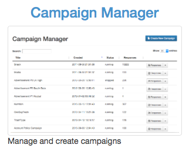
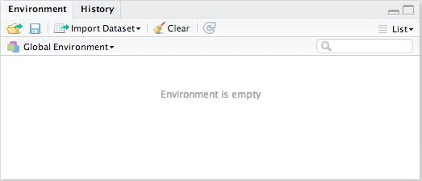
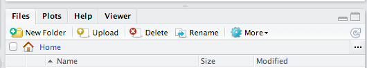

##***<u>Lab 1C - Export, Upload, Import</u>***
Directions: Follow along with the slides and answer the questions in **bold** font in your journal.

###**Whose data? Our data.**
* Throughout the previous labs, we've been using data that was already loaded in RStudio.

    – But what if we want to analyze our own data?
    
* This lab is all about learning how we to load our own participatory sensing data into RStudio

###**Export, upload, import`**
* Before we can perform any analysis, we have to load data into R.

* When we want to get our participatory sensing data into RStudio, we:

* Export the data from the *IDS* page.

* Upload data to *RStudio* server

* Import the data into R's working memory

###**Exporting**
* To begin, go to your class’ *IDS* page.

* Click on the Campaign Manager

* Fill in your username and password and click "Sign in."

    

    If you forget your username or password, ask your teacher to remind you.

###**Campaign Manager**


* After logging in, your screen should look similar to this.

* Click on the dropdown arrow for the campaign you are interested in downloading.

###**Dropdown Arrow**
* The options for the dropdown menu will look like this.

    

* Look for the option labeled *Export Data*. Click it.

* Remember where you save your file!

###**Exporting**
* When you clicked the *Export* link a *.csv* file was saved on your computer.

* Now that the file is on your computer, we need to upload it into RStudio.

###**Uploading**
* Look at the four different *panes* in RStudio.

* Find the *pane* with a Files tab.

* Click it!

    

* Click the button on the *Files* pane that says *Upload*.

* Find the SurveyResponses.csv file you saved to your computer.

* Hit the *ok* button a few times.

* Voila!

* If you look in the Files pane, you should be able to find your data!

###**Upload vs. Import**
* By uploading your data into RStudio you've really only given yourself access to it.

* Don't believe me? Look at the *Environment* pane ... where's your data?

* To actually use the data we need to import it into your computer's memory.

* To compute more quickly and efficiently, R will only keep a few data sets stored in its
memory at a time.

    – By importing data, you are telling R that this is a data set that is important to store it
    in its memory so you can use it.

###**Importing**



* At the top of the *Environment* pane, click the *Import Dataset* button. Then, choose *From
CSV...*

    – CSV is a standard data format used by many software programs.

* Click the Browse... button in the upper right hand corner. Find your data file and click Open.

* Give your data a name using the Name: field in the lower left corner.

###**What's in a name?**
* The name you give your data is what you will use when you write code to analyze your data.

    – Good names are short and descriptive.

    – For your food habits campaign, some good names to use would be "foodhabits" or
    even just "food".

* When you're ready, click the *Import* button.

###**read.csv()**

* After you click *Import* you might notice something appeared in your console.

        data.file <- read_csv("~/SurveyResponse.csv")
        View(data.file)

* This is the actual code ```RStudio``` uses to read your data when you clicked the import button.

* So instead of using the ```RStudio``` buttons, we can actually Import by writing code similar to
what was output into the console!

* This will come in handy later in the course.

###**A word on staying organized...**



* The *Files* tab has a few other features to help keep you organized.

* SurveyResponse probably isn't the best name for your data. Click Rename to give it a
clearer name.

* It is often helpful to give your data file the same name as when you import your data.

* So in this case, we could name our data file *foodhabits.csv*

###**Export, upload, import**

* After you *Export*, *Upload*, *Import* your data you're ready to analyze.

* **```View``` your data, select a variable and try to make an appropriate plot for that variable.**

    – If you're having issues, make sure you're spelling the name of your data correctly.