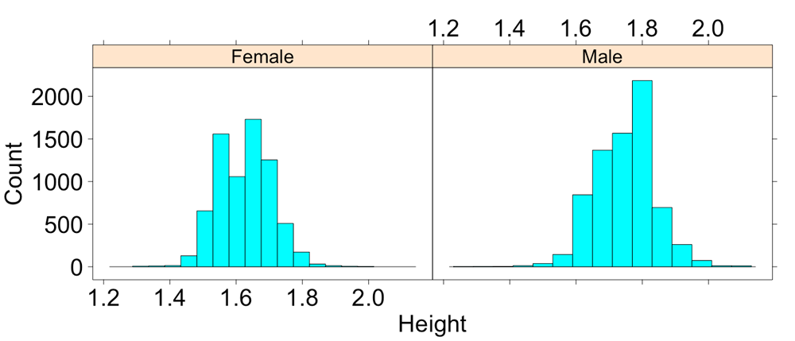
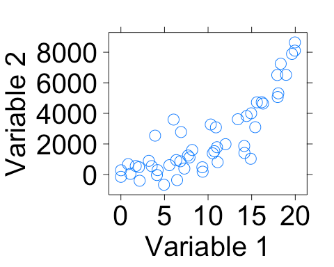

##***<u>Lab 1E - What's the Relationship?</u>***
Directions: Follow along with the slides and answer the questions in **bold** font in your journal.

###**Finding patterns in data.**
* To discover (*really*) interesting observations or relationships in data, we need to find them!

    – Which is difficult if we only look at the raw data.

* The best tool for finding patterns is often ... your own eyes.

    – Plots are an excellent way to help your eye search for patterns.

* In this lab, we'll learn how to include more variables in our plots to make them more
informative.

* Import the data from your class' *Food Habits* campaign and name it ```food```.

###**Where's the variables?**



* **How many variables were used to create this plot? Which variables were used and
how were they used?**

###**Multiple variable plots**
* The previous graph is an example of a *multiple variable plot*, which means that more than a
single variable was used. In this case:

* Variable 1: *height*

* Variable 2: *gender*

* Multiple variable plots are tools for finding *relationships* between data.

* Let's take our ```food``` data and make some new multiple variable plots you haven't created
before!

###**Scatterplots**



###**Creating scatterplots**
* Scatterplots are useful for viewing how one *numerical* variable relates to another *numerical*
variable.

* Fill in the blanks to create a scatterplot with ```sodium``` on the y-axis and ```sugar``` on the x-axis.

        xyplot(____ ~ ____, data = food)

###**Scatterplots in action**
* Use a scatterplot to answer the following questions:

    – **Do snacks that have more ```calories``` also have more ```total_fat```? Why do you
    think that?**

    – **What happens if you swap the ```calories``` and ```total_fat``` variables in your
    code? Does the relationship between the variables change?**

    – **Does the relationship between ```calories``` and ```total_fat``` change when the
    snack is either ```Salty``` or ```Sweet```? Write down the code you used to answer this
    question.**

###**4-variable scatterplots**
* When we make scatterplots, we can include:

    – 1 numerical variable on the x-axis

    – 1 numerical variable on the y-axis

    – Use 1 categorical variable to facet our scatterplot

    – Change the color of the points based on another categorical variable

* To change the color of our points, we can include the ```groups``` argument much like we did for
bargraphs (use the *search* feature in the *History* pane if you need help).

* **Create a scatterplot that uses these 4 variables: ```sodium```, ```sugar```, ```healthy_level```,
```salty_sweet```.**

###**Multiple facets**
* It can sometimes be helpful to facet on more than 1 variable.

    – Splitting the the data using 2 facets can give us additional insights that might
    otherwise be hidden.

* Create a ```dotPlot``` or ```histogram``` of the calories variable, but facet the data using:

        healthy_level + salty_sweet

* **How does the ```healthy_level``` of a ```Salty``` or ```Sweet``` snack impact the number of
```calories``` in the snack?**

###**On your own**
* Answer the following questions by creating an appropriate graph or graphs.

    – **Do healthier snacks ```cost``` more or less than less healthy snacks?**

    – **What other variables seem to be related to the ```cost``` of a snack? Describe their
    relationships.**