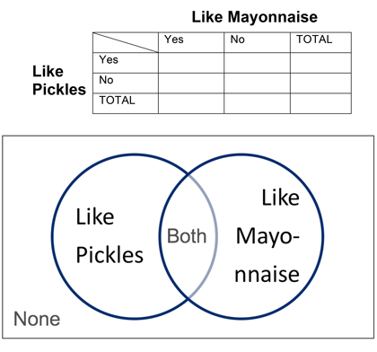

##***<u>Lesson 11: This AND/OR That</u>***

###**Objective:**
Students will understand how AND/OR probabilities are defined and will be able to use frequency tables
to compute these probabilities.

###**Materials:**
1. *Compound Probabilities* handout ([LMR_2.13_Compound Probabilities](../IDS_Curriculum_v_5.0/2_IDS_LMRs_v_5.0/IDS_LMR_Unit 2_v_5.0/LMR_2.13_Compound Probabilities.pdf))

2. Blue sticky notes

3. Gold sticky notes

4. Four signs on the board labeled: *Pickles, Mayonnaise, Both, None* (in that exact order, and
equally spaced across the length of the board)

###**Vocabulary:**
compound probabilities

###**Essential Concepts:**

!!! note "Essential Concepts: "
    What does "A or B" mean versus "A and B" mean? These are compound events
    and two-way tables can be used to calculate probabilities for them.
    
###**Lesson:**
1. Remind the students that they have been learning about estimating probabilities of single events
based on sample proportions. Inform them that, today, they will learn how to calculate proportions
when multiple events happen.

2. Review the basic idea of computing probabilities; in other words, the number of outcomes we are
interested in divided by the total number of outcomes possible.

3. Pose the questions below to the class.

    **<u>Note:</u>** They do not need to come up with specific answers; this is a time for them to make
    suggestions.
    
    100. How would we compute the probability of two outcomes occurring at the same time? For
    example, what is the probability that a randomly chosen student likes both pickles AND
    mayonnaise?

    100. How would we compute the probability of either of two outcomes occurring? For example,
    what is the probability that a randomly chosen student likes either pickles OR
    mayonnaise?

4. For both questions, steer the students towards using the definition from Step 2. That is, we want
the students to realize that they can count the number of people that qualify for the given
circumstance and divide by the total number of people to calculate a probability.

5. In order to define AND/OR probabilities, students will participate in an activity where they are
grouped by their food preferences.

6. Divide the board into 4 groups and write the words “Pickles,” “Both,” “Mayonnaise,” and “None,” in
that order, from left to right.

7. Ask for 10 volunteers to stand by the word that represents their preferences. That is, if they only
like pickles, they should stand by the word “Pickles.” If they like both pickles and mayonnaise,
they should stand by the word “Both.”

    **<u>Note:</u>** If all 4 groups do not have at least one student in them, select a few more students to stand
    at the board.

8. Ask the remaining students (those still seated) to count the total number of people standing by
the board and have a student volunteer share the answer with the class. ***Answers will vary by
class.***

9. Next, create a 2-way frequency table like the one below to organize the values of student
preferences as follows:

    * Counts for students who like both go in the Yes/Like Mayonnaise and Yes/Like Pickles box.

    * Counts for students who like none go in the No/Like Mayonnaise and No/Like Pickles box

    * Counts for students who like only mayonnaise go in the Yes/Like Mayonnaise and No/Like
    Pickles box.

    * Counts for students who like only pickles go in the No/Like Mayonnaise and Yes/Like Pickles
    box.

    **Note:** A Venn diagram like the one below may be used as well, depending on student
    understanding and at teacher discretion.

    

10. Next, ask the students sitting down the following questions:

    100. How many students like both pickles AND mayonnaise? ***Answers will vary by class.***

    100. What is the probability that a randomly selected student at the board likes both pickles
    AND mayonnaise? ***Answers will vary by class. The probability should be calculated
    by dividing the number of people who are standing under “Both” (number given in
    Step 9(a)) by the number of students at the board (number given in Step 8).***

    

11. Now, ask a student from the audience:

    100. How many students like pickles? ***Answers will vary by class.***

        **<u>Note:</u>** Avoid phrasing the question with “Students that like ONLY pickles.” Students need
        to see that students who like “Both” items also belong to the groups liking the individual
        items.

        If students mistakenly report the number of students who like ONLY pickles, ask the
        people at the board to raise their hands if they like pickles and then ask the mistaken
        student to recount.

    100. What is the probability that a randomly selected student at the board likes pickles?
    ***Answers will vary by class. The probability should be calculated by dividing the
    number of people who are standing under “Pickles” and “Both” by the total
    number of students at the board.*** 
    

12. Finally, ask one more student from the audience:

    100. How many students like pickles OR mayonnaise? ***Answers will vary by class.***
    
        **<u>Note:</u>** Avoid phrasing the question with “Students that like ONLY pickles OR ONLY
        mayonnaise.”

        If students mistakenly report the number of students who like ONLY pickles plus the
        students who like ONLY mayonnaise, ask the people at the board to raise their hands if
        they like either pickles or mayonnaise (All students at the board should raise their hand
        except for the students who like “None”) and then ask the mistaken student to recount.
    
    100. What is the probability that a randomly selected student at the board likes pickles OR
    mayonnaise? ***Answers will vary by class. The probability should be calculated by
    dividing the number of people who are standing under “Pickles,” “Mayonnaise,”
    and “Both” by the total number of students at the board.*** 
    

13. Informs students that AND/OR probabilities are called **compound probabilities**. In teams, have
students record their own definitions of AND/OR probabilities based on the activity they just
completed. ***A compound probability is the probability of some combination of events
occurring.***

14. Distribute the *Compound Probabilities* handout ([LMR_2.13](../IDS_Curriculum_v_5.0/2_IDS_LMRs_v_5.0/IDS_LMR_Unit 2_v_5.0/LMR_2.13_Compound Probabilities.pdf)).

<iframe src="https://docs.google.com/viewerng/viewer?url=https://curriculum.idsucla.org/IDS_Curriculum_v_5.0_preview/2_IDS_LMRs_v_5.0/IDS_LMR_Unit 2_v_5.0/LMR_2.13_Compound Probabilities.pdf&embedded=true" style=" width:420px;height:400px;" frameborder="0"></iframe> [LMR_2.13](../IDS_Curriculum_v_5.0/2_IDS_LMRs_v_5.0/IDS_LMR_Unit 2_v_5.0/LMR_2.13_Compound Probabilities.pdf)

15. Pass out a blue sticky note to each female student and a gold sticky note to each male student.

16. Draw the table from the worksheet on the board (make it large and legible).

17. Have each female student hold up their sticky note. Count them and record the number of
females in the appropriate row of the TOTAL column in the table.

18. Have each male student hold up their sticky note. Count them and record the number of females
in the appropriate row of the TOTAL column in the table.

19. Ask each student which of the following ice cream flavors they most prefer (each student must
choose exactly one option): Vanilla, Chocolate or Rocky Road.

    100. Have the students write their ice cream preference on their sticky note.

    100. Fill out the remainder of the table by asking each gender to hold up their preference.

    100. Make sure the totals for preferred ice cream flavors and genders add up to the same
    number.

20. Instruct the students to work in pairs to answer the questions on the *Compound Probabilities*
handout ([LMR_2.13](../IDS_Curriculum_v_5.0/2_IDS_LMRs_v_5.0/IDS_LMR_Unit 2_v_5.0/LMR_2.13_Compound Probabilities.pdf)).

###**Class Scribes:**
One team of students will give a brief talk to discuss what they think the 3 most important topics of the
day were.

###
**Homework & Next Day**

If not completed in class, students should finish the *Compound Probabilities* handout ([LMR_2.13](../IDS_Curriculum_v_5.0/2_IDS_LMRs_v_5.0/IDS_LMR_Unit 2_v_5.0/LMR_2.13_Compound Probabilities.pdf)).

[<u>***LAB 2D: Queue It Up!***</u>](lab2d.md)

Complete [Lab 2D](lab2d.md) prior to the [Practicum](practicum2.md).