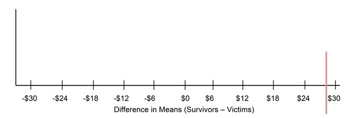

##***<u>Lesson 14: The Titanic Shuffle</u>***

###**Objective:**
Students will continue to understand that, just by chance, we will see differences between two groups.
They will understand that these differences are usually small.

###**Materials:**

1. [*LMR_Titanic Strips*](../IDS_Curriculum_v_5.0/2_IDS_LMRs_v_5.0/IDS_LMR_Unit 2_v_5.0/LMR_Titanic Strips.pdf)

    **Advanced preparation required** (see Step 8 of lesson)

2. Poster paper

3. Markers

###**Essential Concepts:**

!!! note "Essential Concepts: "
    We can also "shuffle" data based on numerical variables. The statistic we use is the
    difference in means. The distribution we form by this form of shuffling still represents what happens if
    chance were the only factor at play. When differences are small, we suspect that they might be due to
    chance. When differences are big, we suspect they might be 'real.'

###**Lesson:**
1. Remind students that they previously learned how to determine if a difference is due to chance by
shuffling based on categorical variables (gender and survival).

2. Display the dotplot created during [Lesson 13](lesson13.md) of the difference in proportions between female and
survivors of horror movies. Remind the students that, "by chance," the differences were typically
.0. Most of the time, they were pretty small. Sometimes they were bigger, but that was rare and
this tells us that if we see "small" differences, we might think they are due to chance. But if we
see "big" differences, they are not.

3. Lead a short discussion about what students think small and big differences mean. Make sure
they answer in units (which are percentage points for the horror movie data). So, for example, a
"big" difference might be 5 percentage points (but don't let them just say "5").

4. Inform students that, during today’s lesson, they will learn how to determine if there is a difference
between groups when a numerical variable is involved.

5. In particular, they will assume the roles of passengers in the *Titanic* for today’s lesson. In case
some students may not know about the *Titanic*, ask a volunteer to share what he/she knows.

6. Explain that, at its time, the *Titanic* was the largest cruise ship ever built and was declared to be
unsinkable. However, on its first voyage, it sank and was one of the worst maritime disasters in
history. About 40% of passengers survived; however, your chances of survival depended very
much on your age, gender, and wealth.

7. Inform the students that we are going to look at whether the amount of money a passenger paid
for his/her cabin (the fare price) had anything to do with whether or not he/she survived.

8. Each student will need a strip from the [*LMR_Titanic Strips*](../IDS_Curriculum_v_5.0/2_IDS_LMRs_v_5.0/IDS_LMR_Unit 2_v_5.0/LMR_Titanic Strips.pdf) file—see below for instructions.

    **Advanced preparation required:**

    The Titanic Strips LMR contains data from 40 actual passengers on the titanic. Each strip
    represents the data from one passenger: the left hand side shows the fare paid and right hand
    side contains the survival information of that passenger after the collision. Cut the LMR into strips
    such that the fare price is attached to the survivor status for each of the 40 observations.
    
<iframe src="https://docs.google.com/viewerng/viewer?url=https://curriculum.idsucla.org/IDS_Curriculum_v_5.0_preview/2_IDS_LMRs_v_5.0/IDS_LMR_Unit 2_v_5.0/LMR_Titanic Strips.pdf&embedded=true" style=" width:420px;height:400px;" frameborder="0"></iframe> [LMR_Titanic Strips](../IDS_Curriculum_v_5.0/2_IDS_LMRs_v_5.0/IDS_LMR_Unit 2_v_5.0/LMR_Titanic Strips.pdf)

9. 40 strips were created for large classes. If your class has less than 40 students, assign the
students to two groups such that roughly 40% of them are in the survivor group (15/40 = 37.5% ≈
40%), and the rest are in the victim group. If your class is small (smaller than 10), then put the
students in two equal sized groups. The split does not have to be exactly 40%.

10. Inform the smaller group that they are the survivors and distribute a survivor strip with its
corresponding fare to each student. Set aside any leftover strips. Tell them that the price on the
strip represents the amount of money paid for their ticket to board the *Titanic*. Notify them that
$20 in 1912 is worth about $500 today.

11. Divulge to the larger group that they, unfortunately, are the victims and distribute a victim strip
with its corresponding fare to each student. Set aside any leftover strips.

12. Ask each group to create a dotplot of their fare prices on a poster. Lead a quick discussion
comparing the two dotplots visually. Then, ask each group to calculate the mean fare for their
group.

13. As a class, find the difference between the mean fares for the two groups.

    mean of “Survivor” fares – mean of “Victim” fares

    ***<u>For example:</u>***

    ***If all 15 survivor cards and all 25 victim cards are used, the difference is
    means would be:***

    ***$43.55 – $17.76 = $25.79***

14. Explain that one of the controversies of the *Titanic* disaster was that some people felt that the rich
people were given better access to the lifeboats than were the poor, so rich people were more
likely to survive. Note that the data represented on the fare cards are only a subset of the actual
*Titanic* data, which had over 800 passengers. However, the data were randomly selected from
the real data and are considered representative of the 800 passengers.

15. In pairs, ask students to discuss the following:

    100. Based on the data from our dotplots, do you think rich people were more likely to
    survive? In other words, did passengers who paid more for their tickets have a better
    chance of survival? ***Yes, there is evidence that rich passengers survived more often
    than poorer passengers. The mean difference between the fare prices of the
    survivors and the victims is $25.79 (see Step 13). Most survivors had higher fare
    prices than the victims, so the distribution of survivor fares is shifted to the right
    and is more right-skewed.***

16. Share out a couple of responses with the whole class.

17. Have students tear their strip such that they separate the fare from the outcome (survivor or
victim). Collect only the outcomes and randomly shuffle them. Students will keep their fare.

    Distribute the shuffled outcome strips face down to the students. Once everyone has a new
    outcome strip, ask students to turn their outcome strip over and re-group based on their new
    survival status.

18. Ask the students:

    100. Why do we shuffle the survivor/victim strips and not the fare strips? ***We want to know if
    the price someone paid for his/her ticket affects whether or not he/she survived.
    So, when we shuffle, we assume that fare price has nothing to do with survival, so
    the prices should be irrelevant.***

    100. What do you think the mean fare difference of our shuffled groups will be? ***The mean
    fare difference of the shuffled groups should be close to 0, meaning that there
    should be NO difference in fare price for the survivors and the victims. Everyone
    would have the same chances of surviving, regardless of their ticket price.***

19. Have each group calculate the mean fare price for their new groups. Then, ask:

    100. Do you think this difference, of ___ dollars, is real or due to chance? ***Answers will vary
    by class. Since the data were shuffled, any difference should be due to chance.***

20. On the board, create a table to display the mean fare prices for each group, and include a column
for the difference (mean “Survivor” fare – mean “Victim” fare). Fill in the table with the values the
students found in Step 13. **<u>Note:</u>** The first row has been filled in with the example data from
above BEFORE the shuffles have taken place.

    | Mean Fare Price of Survivors | Mean Fare Price of Victims | Difference in Means (Survivors - Victims) |
    |------------------------------|----------------------------|-------------------------------------------|
    | $43.55 | $17.76 | $43.55 - $17.76 = $25.79 |
    | ? |  |  |

21. Note that values in the “Difference in Means” column can be positive or negative because
sometimes the survivors will pay more for their tickets, and other times the victims will pay more
for their tickets.

22. Draw a dotplot on the board labeled “Difference in Means.” Include a vertical line at $25.79 (or
whatever value was calculated in Step 13 by the class) to represent the actual difference in the
mean fare prices between the survivors and the victims (see example below).

    

23. Using the information from Steps 19 and 20, place a dot at the corresponding value
for the shuffled data’s difference in means. Ask the students:

    100. How does this difference compare to the actual difference of $25.79 (from Step 13)?
    ***Answers will vary by class. Most likely, the difference in means will be much
    smaller than $25.79. In fact, the difference in means will be centered around 0.***

24. Remind students that small differences might be due to chance and big differences typically
mean that there is a “real” difference between groups. In this case, a big difference might mean
that the rich passengers were more likely to survive. And a small difference might mean that
survival was just a matter of plain luck.

25. Repeat Steps 17 – 23 a few more times (depending on how much class time you have available).

26. In pairs, ask students to discuss whether they think the real difference in mean fare prices they
calculated in Step 13 ($25.79 if all cards were used) is small or large. ***Answers will vary by
class. Guide students to look at the MAD value of the distribution of differences in mean
fares.***

27. Explain that one way that we can decide what is “large” or “small” is by creating cut-off values that
we think are too far away from the center of the distributions of differences. In general, we can
assign a rule that states that any difference in mean fare prices that is greater than 2 MAD values
above or below the mean is considered unusual. This means that any value in the outer edges of
the plot would indicate that a passenger’s ticket price impacted his/her chances of survival.

28. Inform students that they will use RStudio to shuffle the actual *Titanic* data of all 800 passengers
during the next class and can decide if the difference in survival rates of rich passengers and
poor passengers was real, or just due to chance.

###**Class Scribes:**
One team of students will give a brief talk to discuss what they think the 3 most important topics of the
day were.

###
**Homework & Next Day**

For the next 3 days, students will collect data for the *Stress/Chill* campaign either through the UCLA [IDS
UCLA](../download/app.md) App or via web browser at [https://tools.idsucla.org](https://tools.idsucla.org "https://tools.idsucla.org")

[<u>***LAB 2F: The Titanic Shuffle***</u>](lab2f.md)

Complete [Lab 2F](lab2f.md) prior to [Lesson 15](lesson15.md).
