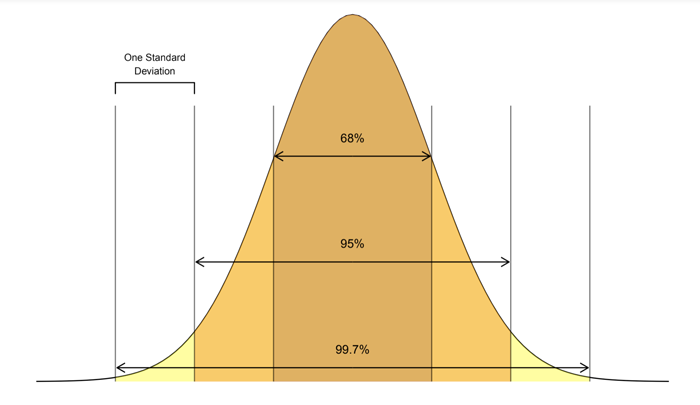
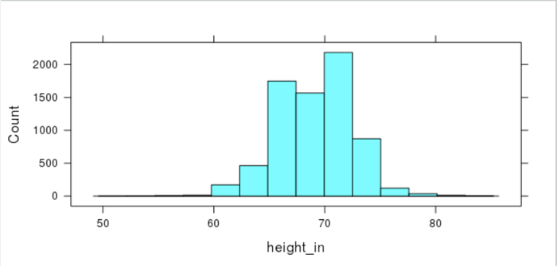

##***<u>Lesson 18: What’s Your Z-Score?</u>***

###**Objective:**
Students will understand that a z-score can be used to measure how far away - or how many standard
deviations - an observation is away from the mean. Usually, z-scores will range between -3 and +3. For
simulations involving shuffling, if we compute a z-score that lies far away from the mean, then we might
conclude that the outcome was not due to chance. If we see a z-score that lies close to the mean, then
we might conclude it was by chance.

###**Materials:**
1. Projector to display RStudio function

2. *RScript with all of the functions in this lesson*

3. *A ruler with centimeter marks on it*

###**Vocabulary:**
z-score, standardized score, Empirical Rule

###**Essential Concepts:**

!!! note "Essential Concepts: "
    z-scores offer us a way to measure how extreme a value is, regardless of the units
    of measurement. Usually, z-scores will range between -3 and +3, so values that are at or are more
    extreme than -3 or +3 standard deviations are considered extremely rare.

###**Lesson:**
1. Ask students to recall what they remember about normal distributions.
    
    ***Answer: Normal distributions are unimodal and symmetric and are often referred to as
    bell-shaped. Some real-life examples of variables that produce normal distributions are
    people’s heights, scores on standardized tests, and body temperatures.***

2. Display the following statement to students: “All normal distributions are bell-shaped, but not all
bell-shaped distributions are normal.” Then inform students that normal distributions have special
properties.

3. Display the image below and introduce the **Empirical Rule**, which states:

    • Approximately 68% of the observations in a normal distribution fall within one standard
    deviation of the mean

    • Approximately 95% of the observations in a normal distribution fall within 2 standard
    deviations of the mean

    • Approximately 99.7% of the observations in a normal distribution fall within 3 standard
    deviations of the mean

    

4. Open RStudio and project for students to see. Using RStudio, load the cdc data and create a new
variable height_in. Subset the data for the males and create a histogram for height_in.

    **> cdc <- mutate(cdc, height_in = height * 39.3701)**

    **> males <- filter(cdc, gender == “Male”)**

    **> histogram(~height_in, data = males)**

    

    **Note:** For students who are skeptical about the distribution being normal, demonstrate how
    changing the number of bins distributes the values to create more of a bell shape.

    **> histogram(~height_in, data = males, nint = 30)**

    

5. Ask students:

    100. Does the distribution of teenage male heights look approximately normal? Explain.
    ***Answer: The distribution of teenage male heights is unimodal and roughly
    symmetric and somewhat bell-shaped, so it might be approximately normal.***
        
    100. What do you approximate the mean height of the distribution to be? standard deviation?
    ***Answers will vary. Use this as a check for understanding of standard deviation.
    See next step for calculating the actual mean.***

6. Use RStudio to calculate the mean and standard deviation to compare student answers to the
actual values.

    **> mean_male_height_in <- mean(~height_in, data = males)**

    **> sd_male_height_in <- sd(~height_in, data = males)**

    

7. Have students draw a number line with seven equally spaced intervals and label it “Teen male
height in inches.” Make sure students leave about 5 centimeters of space above the number line
to draw a normal curve. Have students label the middle tick mark with the mean male height
(Round to the nearest tenth of an inch=69 inches). Then ask students:

    100. What height is one standard deviation above the mean? ***Answer: A teen male whose
    height is 72.4 inches is one standard deviation above the mean male height.***

    100. What height is one standard deviation below the mean? ***Answer: A teen male whose
    height is 65.6 inches is one standard deviation below the mean male height.***

    Have students label their number line with these values.

8. Have students continue filling their number line with the corresponding heights that are 2 and 3
standard deviations from the mean. ***Answer: A male who is 62.2 inches tall is two standard
deviations below the mean male height. A male with a height of 75.8 inches is two
standard deviations above the mean. A male that is 58.8 inches tall is three standard
deviations below the mean, and a male who is 79.2 inches tall is three standard deviations
above the mean.***

9. Ask students: If the distribution of teen male heights is approximately normal, what percentage of
males are between 66.6 inches tall and 72.4 inches tall? ***Answer: If the distribution of male
heights is approximately normal, about 68% of males should be between 65.6 inches and
72.4 inches tall.***

10. Use RStudio to confirm if indeed the distribution of male heights is approximately normal.

    **> one_sd_males <- filter(males, height_in > 65.6, height_in < 72.4)**

    ***Answer: There are 5,119 males in this sample of 7749 males whose height are one
    standard deviation from the mean, so 5119/7749 = 0.66. This means that around 66% of
    males’ heights in this sample fall within one standard deviation from the mean male height.
    This is close to 68%, so it seems that the distribution of male heights is approximately
    normally distributed.***

    **<u>Note:</u>** If you continue this process for this sample you will find that the Empirical rule isn’t a
    perfect model for this distribution, but no distribution is perfectly normally distributed.
    In this sample, 6835/7749=88% of the male heights fall within 2 standard deviations of the mean,
    and 7172/7749=93% of the male heights fall within 3 standard deviations of the mean. Another
    factor that can be contributing to this is the fact that we are considering height of teen males
    rather than adult males. In this case, young men’s heights are slightly more variable since they’re
    still growing; but we can still use the normal distribution as a convenient approximation to reality.

11. Now that it has been verified that a normal distribution is an appropriate model for this distribution,
have students draw a normal curve above the number line. Suggested method to obtain a decent
normal curve:

    • Step 1: Draw a dot 4 centimeters above the mean height

    • Step 2: Draw dots 2.4 cm above the heights that are 1 standard deviation from the mean
    
    • Step 3: Draw dots 0.36 cm above the heights that are 2 standard deviation from the
    mean

    • Step 4: Draw dots right above the number line for the heights that are 3 standard
    deviation from the mean

    • Step 5: Connect the dots with a smooth curve

12. Tell students that we are using this normal curve as a model to represent the distribution of all
teenage male heights. This will allow us to make comparisons, draw conclusions, and make
predictions about male heights. Let’s see:

    100. What proportion of teenage males are shorter than 69 inches? Explain. ***Answer: About
    50% of teenage males are shorter than 69 inches. Since normal distributions are
    symmetric, the mean and the median are about the same. Since the median divides
    a distribution into equal halves, then in this case so does the mean.***
    
    100. What proportion of teenage males are between 69 and 72.4 inches tall? ***Answer: About
    34% of teenage males are between 69 and 72.4 inches tall. According to the
    Empirical rule, 68% of the observations fall within one standard deviation of the
    mean, and since normal distributions are symmetric, the area under the curve from
    the mean to one standard deviation is half of 68% or 34%.***
    
    100. What proportion of males are taller than 72.4 inches? ***Answer: About 16% of teenage
    males are taller than 72.4 inches. From part a and b above, we know that
    50%+34%=84% of teen males are shorter than 72.4 inches, so 100%-84%=16% are
    taller than 72.4 inches.***

13. Inform students that they will now investigate the distribution of teenage female heights. Run
each of these functions from your script one by one. When you run the second function, ask
students if the distribution of teen female heights looks approximately normal. Then inform them
that the approach we are going to take to verify whether it is or not is to overlay the histogram
with a normal curve. Run the third function.

    **> females <- filter(cdc, gender == “Female”)**

    **> histogram(~height_in, data = females)**

    **> histogram(~height_in, data = females, fit = “normal”)**
    
    **> mean(~height_in, data = females)**

    **&nbsp;**

    **> sd(~height_in, data = females)**

14. Repeat steps 7, 8 and 11 with the distribution of teenage female heights.

15. Explain that statisticians use something called a **z-score** to compare values. A z-score tells us
how many standard deviations away from the mean an observation is. Another name for z-score
is a **standardized score**.

16. Introduce the formula for calculating a z-score and discuss what each symbol in the formula
means. Then, demonstrate how to find the z-score for a female height and a male height.

    

17. Explain that z-scores answer the question: how typical is x? If x is the same as the typical value
(the mean), then z = 0. If x is one standard deviation away from the mean, then z = -1 or +1.
Remind students from the normal curve that as you move farther from the center (from the mean),
there are fewer observations. Therefore, a large z-score is considered an unusual value.

18. Have students calculate their z-score. Ask the class:

    100. What does a negative z-score mean? ***A negative z-score means the x value is below
    the mean. This means that the height is below average.***

    100. What does a positive z-score mean? ***A positive z-score means the x value is above
    the mean. This means that the height is above average.***

    100. What is the most negative z-score you think we will find? What is the most positive zscore?
    ***Typically, values in a normal distribution rarely fall outside 2 or 3 standard
    deviations from the mean. So, if our data is purely by chance, we probably won’t
    see any values that are less than -3 or greater than +3.***

19. Ask students: “Where do you fall within the distribution of height for your gender”? Then tell them
to find their height (in inches) on the x-axis of the normal curve corresponding to their gender, and
draw a vertical line from the x-axis until it intersects the normal curve. Have them shade the area
under the curve to the left of the vertical line.

20. Tell students that the shaded area represents their percentile in the distribution. A percentile is
the exact value in which the desired proportion of observations lie below the specific value in a
distribution. For example, with regard to people’s heights, the 70th percentile would be the height
that is taller than exactly 70% of the observations. Ask for a female and male volunteer and use
RStudio to demonstrate how to find the percentile for their respective heights. The sample below
would be used for a teen male that is 70 inches tall.

    **> pnorm(70, mean = 69, sd = 3.4)** = 0.615666

    The following sentence frame can be used to help male students interpret their percentile.
    I am at the <u>&nbsp;&nbsp;&nbsp;&nbsp;62nd&nbsp;&nbsp;&nbsp;&nbsp;</u> percentile in the distribution of teen male heights. That means that I am
    taller than <u>&nbsp;&nbsp;&nbsp;&nbsp;62%&nbsp;&nbsp;&nbsp;&nbsp;</u> of all teen males, but shorter than <u>&nbsp;&nbsp;&nbsp;&nbsp;38%&nbsp;&nbsp;&nbsp;&nbsp;</u> of all teen males.
    Note: A student’s z-score can also be used, but since a z-score is a standardized score, the
    mean of the distribution would be zero and the standard deviation would be 1.

    **> pnorm(0.294, mean = 0, sd = 1)** = 0.615621

21. Inform the class that they will be using RStudio during the next few days to practice using normal
models. Remind them to calculate and interpret their percentile in the distribution of height for
their gender.

###**Class Scribes:**
One team of students will give a brief talk to discuss what they think the 3 most important topics of the
day were.

###
**Next 2 Days**

[<u>***LAB 2H: Eyeballing Normal***</u>](lab2h.md)

[<u>***LAB 2I: R’s Normal Distribution Alphabet***</u>](lab2i.md)

Complete [Labs 2H](lab2h.md) and [2I](lab2i.md) prior to the [End of Unit Design Project](end.md).