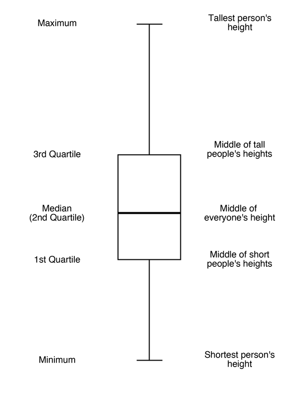

##***<u>Lesson 5: Human Boxplots</u>***

###**Objective:**
Students will learn how and when to use boxplots to compare groups of data. They will learn how to
compute and interpret another measure of spread: the IQR.

###**Materials:**
1. Poster paper, 3-4 feet long

    **Advanced preparation required** (see Step 9 below)

2. Tape

3. Poster paper

4. Markers

5. *Ages of Oscar Winners* handout ([LMR_2.7_Oscar Ages](../IDS_Curriculum_v_5.0/2_IDS_LMRs_v_5.0/IDS_LMR_Unit 2_v_5.0/LMR_2.7_Oscar Ages.pdf))

###**Vocabulary:**
boxplot, quartiles, first quartile (Q1), third quartile (Q3), quantiles, minimum, maximum, five-number
summary, range, interquartile range (IQR)

###**Essential Concepts:**

!!! note "Essential Concepts: "
    A common statistical question is “How does this group compare to that group?”
    This is a hard question to answer when the groups have lots of variability. One approach is to compare
    the centers, spreads, and shapes of the distributions. Boxplots are a useful way of comparing
    distributions from different groups when all of the distributions are unimodal (one hump).

###**Lesson:**
1. Remind students that we have been using the following numerical and graphical summaries to
look at data:

    100. Measures of center – mean, median

    100. Measures of spread – MAD

    100. Graphing – dotPlots, histograms

2. Explain that all of these tools help us describe data to someone who may not actually be viewing
it. Today, we will explore another way to summarize and describe data to others with the use of
another type of statistical plot that involves breaking data up into distinct pieces: a **boxplot**.

3. For the next activity, students will need to carry their DS journals and a pen with them.

4. Instruct students to stand up and move their chairs away from the longest wall in the classroom.
Ask them to line up against the wall (in no particular order).

    **<u>Note:</u>** If there isn’t enough room for everyone to line up together inside the classroom, you may
    do this activity outside along a building wall.

5. Say, “I want to know which person represents the typical height of students in our class. Can I tell
by looking at the line as it currently stands? How would I be able to tell?” Students should discuss
with a partner.

6. Ask students to share their discussions. Call on students to contribute to what has been shared if
needed. Guide students to see that organizing the data (in other words, themselves) can give you
a visual for their heights. Then tell them to line up in height order from shortest to tallest along the
wall.

7. Once students are arranged (and this may take a little time—allow students to develop their own
algorithm for finding the ordering), ask them how they might be able to describe their distribution
of heights. ***Possible answers include: mean, median, MAD.***

8. Ask them to split themselves into two groups, one half that is taller and one half that is shorter,
and have them decide which student represents the class’s median height.

9. Have the median student stand next to the wall directly in front of the poster paper.

    **Advanced preparation required:** Before class begins, tape a piece of poster paper,
    approximately 3-4 feet long, vertically to a wall in the classroom. The students will be
    creating a plot using lines drawn at certain students’ heights.

10. Draw a horizontal line on the poster paper to mark the location of the median by having the actual
student stand in front of the poster paper so you can mark his/her exact height. Be sure to label
this point as the median and include the student’s actual height, in inches.

11. Next, ask the two halves to split again, so there are now four groups of students.

12. The breaks between each group are called **quartiles** because they break the data into four
groups (*quartile* comes from the Latin word *quartus*, which is also the root of the Spanish word
*cuatro*). The lower break represents the **first quartile** (because 25% of the class is shorter than
this student’s height), and the upper break represents the **third quartile** (because 75% of the
class is shorter than this height). Another term that can be used in place of percentiles is
**quantiles** because they represent the *quantity* of data that is lower than that value.

13. Using the student who represents the first quartile, draw another horizontal line on the poster
paper marking his/her height. The student should stand in the same spot as the student who
represented the median so that the line for this student is drawn underneath the median line. Be
sure to label this point as the first quartile (or **Q1**) and include the student’s actual height, in
inches.

14. Using the student who represents the third quartile, draw another horizontal line on the poster
paper marking his/her height. The student should stand in the same spot as the student who
represented the median so that the line for this student is drawn above the median line. Be sure
to label this point as the third quartile (or **Q3**) and include the student’s actual height, in inches.

15. Finally, ask the tallest and shortest student to stand in front of the poster paper and draw
horizontal lines at their heights. The shortest person represents the **minimum** height of the
students in the class, and the tallest person represents the **maximum** height. Be sure to label the
points as the minimum and maximum, and include the students’ actual heights, in inches.

16. When you finish, you should have five lines, which represent the **five-number summary**:
minimum, first quartile, median, third quartile, and maximum. Draw a box using the first and third
quartiles as the edges of the box. The median line will be contained within the box. Extend a line
from the first quartile down to the minimum and extend a line from the third quartile up to the
maximum. Your class’s boxplot should look similar to the following:

    

17. Students should now be facing the newly created boxplot. Allow students time to sketch the
boxplot in their DS journals, with the appropriate labels.

18. Ask students:

    100. What is the difference between the largest and smallest heights? Is there a large
    difference between the tallest and shortest person? ***Students should calculate
    maximum – minimum.*** Inform students that this difference is known as the **range** of the
    data set.

    100. What is the difference between the quartiles Q1 and Q3? What percent of our class falls
    within these two values? ***Students should calculate Q3 – Q1. 50% of the class falls
    between these two height values.*** Inform students that this difference is known as the
    **interquartile range (or IQR)**.

19. Remind students that they learned about one measure of spread (the MAD) during the previous
lesson, and tell them that we now have another measure of spread – the IQR. Pose the following
questions to the students:

    100. What does it mean when the IQR is small? ***The middle 50% of heights are close to
    each other.***

    100. What does it mean when the IQR is large? ***The middle 50% of heights are more
    spread out.***

20. Finally, subset the class into males and females. Ask each group of students (the males and
females) to create a boxplot of their group’s heights on a piece of poster paper using the
techniques they just learned as a class.

21. Ask each group to share their boxplot with the class. Lead a discussion about the similarities and
differences between the plots, and be sure to include how they compare to the overall combined
boxplot of heights they created earlier. In the discussion, have the students calculate the IQR for
both plots and make a comparison by asking: What does the IQR tell us about each group?
***Answers will vary by class.***

###**Class Scribes:**
One team of students will give a brief talk to discuss what they think the 3 most important topics of the
day were.

###
**Homework**

Students should complete the *Ages of Oscar Winners* handout ([LMR_2.7](../IDS_Curriculum_v_5.0/2_IDS_LMRs_v_5.0/IDS_LMR_Unit 2_v_5.0/LMR_2.7_Oscar Ages.pdf)) for homework using their
newly acquired knowledge of boxplots

<iframe src="https://docs.google.com/viewerng/viewer?url=https://curriculum.idsucla.org/IDS_Curriculum_v_5.0_preview/2_IDS_LMRs_v_5.0/IDS_LMR_Unit 2_v_5.0/LMR_2.7_Oscar Ages.pdf&embedded=true" style=" width:420px;height:400px;" frameborder="0"></iframe> [LMR_2.7](../IDS_Curriculum_v_5.0/2_IDS_LMRs_v_5.0/IDS_LMR_Unit 2_v_5.0/LMR_2.7_Oscar Ages.pdf)
