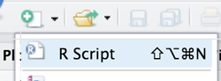
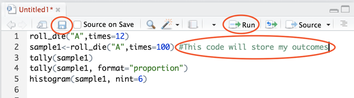

##***<u>Lesson 9: Bias Detective</u>***

###**Objective:**
Students will learn how to use simulations to detect biased probability.

###**Materials:**
1. Poster paper – with 6 columns labeled 1, 2, 3, 4, 5, 6

2. 2 dice (number cubes)

    **<u>Note:</u>** You can use regular hard dice, or soft foam dice (can be found at dollar stores)

3. Projector for RStudio functions

###**Vocabulary:**
bias

###**Essential Concepts:**

!!! note "Essential Concepts: "
    In the short-term, actual outcomes of chance experiments vary from what is 'ideal.'
    An ideal die has equally likely outcomes. But that does not mean we will see exactly the same number of
    one-dots, two-dots, etc.

###**Lesson:**

1. In pairs, ask students to quickly share their Tweets from the previous lesson’s homework. Collect
the Tweets and select a few to share with the class. Of the Tweets shared, ask students which
one is closest to the definition: probability measures how often something happens in the “long
run.”

2. Remind students that, during the previous lesson, they were introduced to simulations. The
progression following this path: chance → probability → simulations. The motivation for using
simulations is that we can use the calculated sample proportions to estimate probabilities of reallife
events.

3. During today’s lesson, we will be continuing to learn about probability and simulations to
determine if an event is not fair (one example: a coin is weighted and lands on heads more often
than tails).

4. Ask students what they know about dice (number cubes). If they have never heard of them, show
one to the class and explain how it works. ***A die (number cube) is a 6-sided cube. Each face of
the cube is labeled with dots to represent a number between 1 and 6. For example, if the
face has 3 dots, then it represents the number 3. The cube itself is weighted so that there
is an equal probability of rolling each of the 6 numbers.***

5. Have a discussion about what the students would expect the probability of rolling the number 1
should be if a die (number cube) were tossed into the air and allowed to fall back to the ground
(or table). ***Since there are 6 numbers on the die, each number should be equally likely to
occur, so the probability of rolling a 1 is 1/6.***

6. Display a piece of poster paper on the board with columns labeled 1, 2, 3, 4 5, 6. Explain that
each column represents the numbers on the die (number cube). We will be using poster to tally
the results of actual dice (number cube) rolls.

7. Select two students to be dice (number cube) rollers and give each student one die. As noted in
the *<u>Materials</u>* section above, you can have the students use either regular hard dice, or softer
foam ones (can be found at dollar stores).
8. Tell the class that each student roller will be rolling the dice 6 times (so there will be a total of 12
rolls for our sample). Ask:

    100. If they are rolling the dice 6 times, how often do you think Student 1 will roll a 3? Would
    you expect it to be the same for Student 2? ***Out of 6 rolls, we would expect to see
    each of the numbers one time, so we will most likely see about one 3 for Student 1.***

    100. Would you expect the Student 2 to roll a 3 just as often? Why? ***Yes, we should expect
    the same thing from Student 2 because we have independent events. There are
    actually two ways that independence plays a part here: (1) each student is
    independent from the other and has no effect on what the other will roll, (2) the 6
    die rolls for Student 1 are all independent of each other because each face of the
    cube has an equal chance of happening on any given roll. So, if Student 1 gets a 3
    during his/her first roll, that doesn’t give us any information about what he/she will
    get on the second roll.***

    100. Since we will have 12 rolls (and therefore 12 samples), how many tally marks should we
    expect in each column on the chart? ***We would expect to see 2 tally marks in each
    column (each number will probably be rolled twice).***

9. Have each student roller toss his/her die one time and share the outcomes with the rest of the
class. As they do this, place a tally mark in the corresponding column on the chart. Repeat this
process 5 more times so that each student has a total of 6 rolls.

10. As a class, observe the results in the chart and discuss the following:

    100. Do the data from these 12 rolls match what we expected (see responses from Step 8)? Is
    this surprising? ***Answers will vary by class. Some values may have shown up more
    than we expected (example: the number 3 was rolled 3 times), and others may not
    have been rolled at all (example: the number 5 was never an outcome). We only
    have a small sample of data, so it’s not surprising for our results to vary from the
    expected outcomes.***

    100. If the data do not match our expectations, does this mean the dice are unfair in some
    way? ***Even if they don’t match our expectations, this does not mean the dice are
    unfair – we simply don’t have enough data yet to know. We would need to roll the
    dice more.***

    100. If we wanted to purposely create an unfair die, what are some ways we could achieve
    that? ***Answers will vary by class. Some examples include: (1) We could add tape to
    one face of the die to give that side more weight. This would increase the chances
    of the number that is directly opposite of it appearing because the die will land on
    the heavier side more (and therefore the side facing up will the be number
    opposite). (2) We could chip the edge of one corner of the die. This would throw off
    the original balance and favor certain sides.***

11. Similar to the previous day’s lesson with coin flipping, we can also simulate dice rolls in RStudio.
The function required is called **roll_die()**. The arguments for this function are a bit different
than the **rflip()** function from yesterday. We cannot simply put **roll_die(1)** for the computer
to roll a die one time. Instead, the function was built with 2 possible dice to choose from – die A
and die B.

12. Inform the students that one of the dice in the function is fair and the other has been created with
**bias**. Bias is the act of favoring one outcome over another. They will attempt to determine which
dice is the biased one by doing multiple simulations.

    **Note to Teacher:** Many simulations require multiple functions, or code, to perform. This is where
    RScripts are helpful. An RScript can be used to test code, write notes, and let us easily execute
    multiple lines of code at one time. This would be a good place to introduce students to RScripts.

    

13. Using a projector to display your computer screen to the whole class, demonstrate how to open
an RScript. Type the following function on your script and click Run. Run simply pastes the
function onto the console.

    **> roll_die(“A”, times = 1)**

14. The output will show one number that represents what value on the die the computer rolled. Go
back to your script and modify the function to roll die A 12 times.

    **> roll_die(“A”, times = 12)**

15. Compare the results of these 12 simulated rolls to the results of the 12 actual rolls completed by
the two students during Step 9. If there is space available on the tally chart, you can add the
computer results to it for an easy comparison.

16. Ask students how we could record data from these simulations if we wanted to roll the die 100
times. Would they want to hand count the number of times each value occurred? Is there a
function in RStudio that will count them for us? ***It would be difficult to count every individual
value in the output on the screen. However, we can use the tally() function to find out
how many times each die value appeared.***

17. To make using the **tally()** function easier, we should assign a name to each simulation so we
don’t have to type the entire function multiple times. We can also have it calculate the proportions
for each value. Add the functions below to your RScript and run them one at a time.

    **> sample1 <- roll_die(“A”, times = 100)**

    **> tally(sample1)**

    **> tally(sample1, format = “proportion”)**

18. Remind the students that if the die is fair, then the each side of the die should appear roughly the
same amount of times. Therefore, the proportions should be fairly similar to each other and to the
true probability of 1/6.

19. Add the function below to your script, but before running it, ask the students what they think a
histogram of the simulated data might look like and then run the command on your screen. Note:
Be sure to include the argument **nint = 6** so that the resulting histogram has six bars. ***If the die
is fair, each of the bars in the histogram should be roughly the same height.***

    **> histogram(sample1, nint = 6)**

    Note to teacher: Show students how to save an RScript. Inform students that they can take notes
    on their RScript by including a hashtag (also known as a pound sign or #) at the beginning of the
    note. Data scientists refer to these types of notes as “code comments” or simply “comments”. See
    image below.

    

    The Script will be stored in the files tab. To run each function individually, place your cursor on
    the line and hit the Run button. To run multiple lines of code at once, highlight them and hit Run.

20. Allow the students to access their school computers now to start creating their own simulations in
an RScript using die B. Students can pair up, if needed. Have them begin by asking RStudio to
roll the die 100 times. They should note their output from both the **tally()** function and the
histogram. They can then compare the results to those from Step 14. Are they similar? Can they
determine which die is unfair yet? ***Answers will vary by class. The results will be similar, but
not exact. With the sample sizes of each simulation being fairly small, we cannot see a
clear difference between the two dice yet.***

21. Let the students explore by changing the number of times RStudio rolls the dice. Remind them
that the goal is to determine which of the two dice is biased. **<u>Note:</u>** The sample sizes need to be
very large in order for them to see a clear difference between the 2 histograms. The pattern
becomes more visible when **times = 2000**.

22. When students have had enough time to make a decision regarding which dice is biased and how,
engage the class in a discussion to verify that everyone agrees. ***Die B is biased; Die A is fair.
Die B favors the number 3.***

23. Then, steer the conversation towards why the sample size affected the results. ***The sample size
needed to be large because the difference between the probabilities of the die rolls was
very small. In order to detect small differences, we must have larger sample sizes.***

###**Class Scribes:**
One team of students will give a brief talk to discuss what they think the 3 most important topics of the
day were.

###
**Homework**

Students will consider a four-sided die and imagine rolling it 20 times. They should sketch a
histogram of (a) the ideal, expected outcome, (b) an outcome that they think is “realistic,” and (c) an
outcome they might see if the die were biased to produce more 4’s.