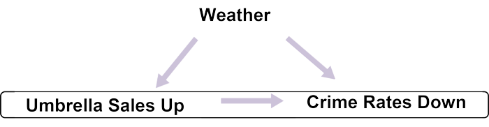
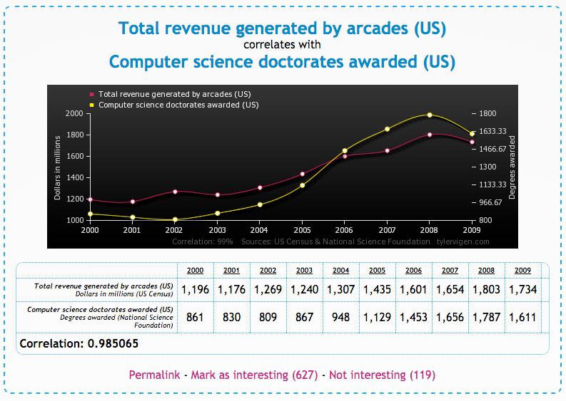

##***<u>Lesson 8: Monsters that Hide in Observational Studies</u>***

###**Objective:**
Students will learn about confounding factors that may impact the results of an observational study, which
is why causation can never be concluded with observational studies, only associations between variables.

###**Materials:**
1. Computers

2. *Spurious Correlations* website ([tylervigen.com](http://tylervigen.com/spurious-correlations))

###**Vocabulary:**
cause, confounding factors, associated

###**Essential Concepts:**

!!! note "Essential Concepts: "
    Confounding factors/variables make it difficult to determine a cause-and-effect
    relation between two variables.

###**Lesson:**
1. Ask students to recall that they looked at the relationship between a student’s GPA and the
number of friends that person has on social media during lesson 6. It seemed that students with
higher GPAs had more friends than students with lower GPAs. But did this mean that the **cause**
of a person’s GPA is the amount of friends they have? NO!

2. They also identified other variables that could have contributed to the relationship, these outside
variables are called **confounding factors**. Confounding factors are variables that are related to
both the explanatory variable and the response variable in an observational study.

3. Propose the following statement to students: “Research suggests that a rise in umbrella sales
leads to decreased crime rates.”

4. Allow the students to work in teams to think about possible confounding factors. They should
choose a variable that is related to umbrella sales, and that might be lead to decreased crime
rates. After they’ve come up with a few possibilities, use the following diagram progression to
further explain the impact of confounding factors.

    100. Step 1: Draw an arrow showing that “a rise in umbrella sales leads to decreased crime
    rates” since that is what researchers have stated.

        

    100. Step 2: Include the variable that might be related to people buying more umbrellas (i.e.,
    the confounding factor). For example, when the weather is rainy, people buy more
    umbrellas.

        

    100. Step 3: Draw an additional arrow from “Weather” to “Crime Rates Down” because it is
    well known that when the weather is bad, people are less likely to be outside committing
    crimes.

        

    100. Step 4: Remind students that the original claim was that “a rise in umbrella sales leads to
    decreased crime rates”.” However, we’ve now shown that maybe buying umbrellas is not
    the only thing that could be contributing to a decrease in crime, which makes us question
    the link between the two variables.

        

    100. Step 5: Therefore, we have found a confounding factor with the variable “crime rates.”
    This means we can erase the original “link” between a rise in umbrella sales and
    decreased crime rates since there are outside variables interfering. We can’t say buying
    umbrellas *causes* decreased crime rates, but we can say that a rise in umbrella sales are
    **associated** with decreased crime rates.

        

5. Once the students grasp what confounding factors are and how to identify them, introduce them
to the website *Spurious Correlations* by Tyler Vigen. This site shows many explanatory and
response variables that are randomly associated with each other. Spurious Correlations can be
found at: [http://www.tylervigen.com/spurious-correlations](http://www.tylervigen.com/spurious-correlations "http://www.tylervigen.com/spurious-correlations").

    

6. For the example given above, we see that as the US spends more money on science, space, and
technology, more people are dying by way of suicide. Clearly, it does not make sense that if the
US keeps spending money on science, then more people are going to commit suicide. It simply
happened by chance (or a bizarre chain of confounding factors) that the two variables are related
to each other.

7. Allow the students to explore the website on their own (Note: there are multiple pages of graphs,
so they are not restricted to simply the homepage). They should choose a graph that interests
them and answer the following questions in their DS journals:

    100. What are the two variables shown in your graph?

    100. Is there a positive association or a negative association between the variables?

    100. Write an interpretation of this plot in the context of the data.

    100. Write the data points in a "spreadsheet format" in a form that RStudio could read. Each
    row should represent a point on the graph, and each column one of the two variables.

    100. By hand, make a scatterplot of the association. Describe whether the association seems
    strong or weak or moderate to you.

    100. Do you think that the explanatory variable *causes* the response variable? Explain.

    100. If you answered 'no' to f, then draw a diagram like in #4 with possible confounding factors.

        **Note:** this can be difficult, depending on the graph chosen. Some factors to consider:
        weather, economy, fashion trends.

8. Example answers to Step 7 are given below:

    

    100. What are the two variables shown in your graph? ***Total revenue generated by arcades
    in the US and the number of computer science doctorates awarded.***

    100. Is there a positive association or a negative association between the variables? ***There is
    a direct relationship because the lines have the same shape (they follow the same
    pattern).***

    100. Write an interpretation of this plot in the context of the data. ***It seems that as more
    doctorates are awarded to computer scientists, arcades are generating more
    revenue.***

        ***Arcade Revenue &nbsp;&nbsp;&nbsp;&nbsp;CS doctorates***

        ***&nbsp;&nbsp;&nbsp;&nbsp;&nbsp;&nbsp;&nbsp;&nbsp;&nbsp;&nbsp;&nbsp;&nbsp;&nbsp;&nbsp;&nbsp;&nbsp;&nbsp;&nbsp;&nbsp;&nbsp;1196 &nbsp;&nbsp;&nbsp;&nbsp;861***

        ***&nbsp;&nbsp;&nbsp;&nbsp;&nbsp;&nbsp;&nbsp;&nbsp;&nbsp;&nbsp;&nbsp;&nbsp;&nbsp;&nbsp;&nbsp;&nbsp;&nbsp;&nbsp;&nbsp;&nbsp;1176 &nbsp;&nbsp;&nbsp;&nbsp;830***

        ***etc.***

    100. Answers will vary.

    100. Can you conclude that the one variable *causes* the other? ***No. Although the two
    variables are associated with one another, we do not have evidence to say that
    more doctorate awards cause arcades to make more money because the data do
    not come from a controlled experiment.***

    100. Draw a diagram like the one we did together earlier (in step 4 of lesson) with possible
    confounding factors. ***Student’s diagram should look like the one below:***

        

9. Once all students have selected a graph and have answered the above questions, have them
share their responses with a partner. They should explain why they thought their particular graph
was interesting, how the two variables are related (directly or inversely), and whether or not there
is a causal link between the variables.

10. At the end of this lesson, students should understand that causation can only be concluded when
an experiment is performed, but associations can be concluded for observational studies.

###**Class Scribes:**
One team of students will give a brief talk to discuss what they think the 3 most important topics of the
day were.

###
**Next Day**

[<u>***LAB 3B: Confound it all!***</u>](lab3b.md)

Complete [Lab 3B](lab3b.md) prior to [Lesson 9](lesson9.md).