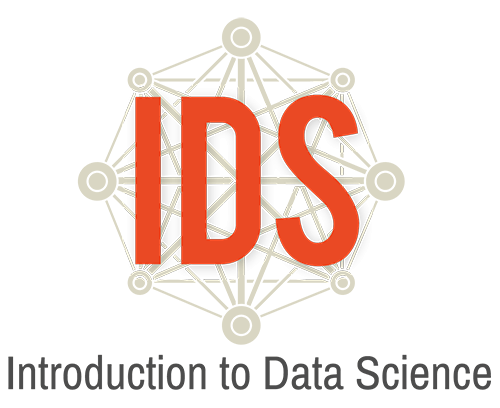

#Introduction to Data Science Daily Overview: Unit 3

**<h1>Unit 3</h1>**

##**Daily Overview: Unit 3**

<table class="tg">
  <tr>
    <th class="tg-88nc">Theme</th>
    <th class="tg-88nc">Day</th>
    <th class="tg-88nc">Lessons and Labs</th>
    <th class="tg-88nc">Campaign</th>
    <th class="tg-88nc">Topics</th>
    <th class="tg-88nc">Page</th>
  </tr>
  <tr>
    <td class="tg-5e9r" rowspan="7">Testing, Testing… 1, 2, 3… (7 days)</td>
    <td class="tg-5e9r">1</td>
    <td class="tg-pwj7"><a href="../../unit3/lesson1">Lesson 1: Anecdotes vs. Data</a></td>
    <td class="tg-pwj7"></td>
    <td class="tg-pwj7">Reading articles critically, data</td>
    <td class="tg-5e9r"><a href="../../unit3/lesson1">221</a></td>
  </tr>
  <tr>
    <td class="tg-5e9r">2</td>
    <td class="tg-pwj7"><a href="../../unit3/lesson2">Lesson 2: What is an Experiment?</a></td>
    <td class="tg-pwj7"></td>
    <td class="tg-pwj7">Experiments, causation</td>
    <td class="tg-5e9r"><a href="../../unit3/lesson2">224</a></td>
  </tr>
  <tr>
    <td class="tg-5e9r">3</td>
    <td class="tg-pwj7"><a href="../../unit3/lesson3">Lesson 3: Let’s Try an Experiment!</a></td>
    <td class="tg-pwj7"></td>
    <td class="tg-pwj7">Random assignments, confounding factors</td>
    <td class="tg-5e9r"><a href="../../unit3/lesson3">227</a></td>
  </tr>
  <tr>
    <td class="tg-5e9r">4</td>
    <td class="tg-pwj7"><a href="../../unit3/lesson4">Lesson 4: Predictions, Predictions</a></td>
    <td class="tg-pwj7"></td>
    <td class="tg-pwj7">Visualizations, predictions</td>
    <td class="tg-5e9r"><a href="../../unit3/lesson4">229</a></td>
  </tr>
  <tr>
    <td class="tg-5e9r">5</td>
    <td class="tg-pwj7"><a href="../../unit3/lesson5">Lesson 5: Time Perception Experiment</a></td>
    <td class="tg-pwj7"></td>
    <td class="tg-pwj7">Elements of an experiment</td>
    <td class="tg-5e9r"><a href="../../unit3/lesson5">231</a></td>
  </tr>
  <tr>
    <td class="tg-5e9r">6</td>
    <td class="tg-pwj7"><a href="../../unit3/lab3a">Lab 3A: The results are in!</a></td>
    <td class="tg-pwj7"></td>
    <td class="tg-pwj7">Analyzing experiment data</td>
    <td class="tg-5e9r"><a href="../../unit3/lab3a">233</a></td>
  </tr>
  <tr>
    <td class="tg-5e9r">7</td>
    <td class="tg-pwj7"><a href="../../unit3/practicum1">Practicum: Music to my Ears</a></td>
    <td class="tg-pwj7"></td>
    <td class="tg-pwj7">Design an experiment</td>
    <td class="tg-5e9r"><a href="../../unit3/practicum1">234</a></td>
  </tr>
  <tr>
    <td class="tg-uys7" rowspan="4">Would You Look at That? (4 days)</td>
    <td class="tg-uys7">8</td>
    <td class="tg-xldj"><a href="../../unit3/lesson6">Lesson 6: Observational Studies</a></td>
    <td class="tg-xldj"></td>
    <td class="tg-xldj">Observational study</td>
    <td class="tg-uys7"><a href="../../unit3/lesson6">237</a></td>
  </tr>
  <tr>
    <td class="tg-uys7">9</td>
    <td class="tg-xldj"><a href="../../unit3/lesson7">Lesson 7: Observational Studies vs. Experiments</a></td>
    <td class="tg-xldj"></td>
    <td class="tg-xldj">Observational study, experiment</td>
    <td class="tg-uys7"><a href="../../unit3/lesson7">239</a></td>
  </tr>
  <tr>
    <td class="tg-uys7">10</td>
    <td class="tg-xldj"><a href="../../unit3/lesson8">Lesson 8: Monsters that Hide in Observational Studies</a></td>
    <td class="tg-xldj"></td>
    <td class="tg-xldj">Observational study, confounding factors</td>
    <td class="tg-uys7"><a href="../../unit3/lesson8">241</a></td>
  </tr>
  <tr>
    <td class="tg-uys7">11</td>
    <td class="tg-xldj"><a href="../../unit3/lab3b">Lab 3B: Confound it all!</a></td>
    <td class="tg-xldj"></td>
    <td class="tg-xldj">Confounding factors</td>
    <td class="tg-uys7"><a href="../../unit3/lab3b">245</a></td>
  </tr>
  <tr>
    <td class="tg-5e9r" rowspan="9">Are You Asking Me? (9 days) </td>
    <td class="tg-5e9r">12</td>
    <td class="tg-pwj7"><a href="../../unit3/lesson9">Lesson 9: Survey Says…</a></td>
    <td class="tg-pwj7"></td>
    <td class="tg-pwj7">Survey</td>
    <td class="tg-5e9r"><a href="../../unit3/lesson9">249</a></td>
  </tr>
  <tr>
    <td class="tg-5e9r">13</td>
    <td class="tg-pwj7"><a href="../../unit3/lesson10">Lesson 10: We’re So Random</a></td>
    <td class="tg-pwj7"></td>
    <td class="tg-pwj7">Data collection, random samples</td>
    <td class="tg-5e9r"><a href="../../unit3/lesson10">252</a></td>
  </tr>
  <tr>
    <td class="tg-5e9r">14</td>
    <td class="tg-pwj7"><a href="../../unit3/lesson11">Lesson 11: The Gettysburg Address</a></td>
    <td class="tg-pwj7"></td>
    <td class="tg-pwj7">Sampling bias</td>
    <td class="tg-5e9r"><a href="../../unit3/lesson11">256</a></td>
  </tr>
  <tr>
    <td class="tg-5e9r">15</td>
    <td class="tg-pwj7"><a href="../../unit3/lab3c">Lab 3C: Random Sampling</a></td>
    <td class="tg-pwj7"></td>
    <td class="tg-pwj7">Random sampling</td>
    <td class="tg-5e9r"><a href="../../unit3/lab3c">261</a></td>
  </tr>
  <tr>
    <td class="tg-5e9r">16</td>
    <td class="tg-pwj7"><a href="../../unit3/lesson12">Lesson 12: Bias in Survey Sampling</a></td>
    <td class="tg-pwj7"></td>
    <td class="tg-pwj7">Bias, sampling methods</td>
    <td class="tg-5e9r"><a href="../../unit3/lesson12">263</a></td>
  </tr>
  <tr>
    <td class="tg-yj5y">16</td>
    <td class="tg-y698"><a href="../../unit3/lesson13">Lesson 13: The Confidence Game</a></td>
    <td class="tg-y698"></td>
    <td class="tg-y698">Confidence intervals</td>
    <td class="tg-yj5y"><a href="../../unit3/lesson13">266</a></td>
  </tr>
  <tr>
    <td class="tg-5e9r">17</td>
    <td class="tg-pwj7"><a href="../../unit3/lesson14">Lesson 14: How Confident Are You?</a></td>
    <td class="tg-pwj7"></td>
    <td class="tg-pwj7">Confidence intervals, margin of error</td>
    <td class="tg-5e9r"><a href="../../unit3/lesson14">269</a></td>
  </tr>
  <tr>
    <td class="tg-5e9r">18</td>
    <td class="tg-pwj7"><a href="../../unit3/lab3d">Lab 3D: Are You Sure about That?</a></td>
    <td class="tg-pwj7"></td>
    <td class="tg-pwj7">Bootstrapping</td>
    <td class="tg-5e9r"><a href="../../unit3/lab3d">271</a></td>
  </tr>
  <tr>
    <td class="tg-5e9r">19</td>
    <td class="tg-pwj7"><a href="../../unit3/practicum2">Practicum: Let’s Build a Survey!</a></td>
    <td class="tg-pwj7"></td>
    <td class="tg-pwj7">Non-biased survey design</td>
    <td class="tg-5e9r"><a href="../../unit3/practicum2">274</a></td>
  </tr>
  <tr>
    <td class="tg-uys7" rowspan="5">What’s the Trigger? (5 days)</td>
    <td class="tg-uys7">20</td>
    <td class="tg-xldj"><a href="../../unit3/lesson15">Lesson 15 Ready, Sense, Go!</a></td>
    <td class="tg-xldj"></td>
    <td class="tg-xldj">Sensors, data collection</td>
    <td class="tg-uys7"><a href="../../unit3/lesson15">277</a></td>
  </tr>
  <tr>
    <td class="tg-uys7">21</td>
    <td class="tg-xldj"><a href="../../unit3/lesson16">Lesson 16: Does it have a Trigger?</a></td>
    <td class="tg-xldj"></td>
    <td class="tg-xldj">Survey questions, sensor questions</td>
    <td class="tg-uys7"><a href="../../unit3/lesson16">280</a></td>
  </tr>
  <tr>
    <td class="tg-uys7">22</td>
    <td class="tg-xldj"><a href="../../unit3/lesson17">Lesson 17: Creating Our Own Participatory Sensing Campaign</a></td>
    <td class="tg-xldj"></td>
    <td class="tg-xldj">Participatory sensing campaign creation</td>
    <td class="tg-uys7"><a href="../../unit3/lesson17">283</a></td>
  </tr>
  <tr>
    <td class="tg-uys7">23</td>
    <td class="tg-xldj"><a href="../../unit3/lesson18">Lesson 18: Evaluating Our Own Participatory Sensing Campaign</a> </td>
    <td class="tg-xldj"></td>
    <td class="tg-xldj">Statistical questions, evaluate campaign</td>
    <td class="tg-uys7"><a href="../../unit3/lesson18">286</a></td>
  </tr>
  <tr>
    <td class="tg-uys7">24^</td>
    <td class="tg-xldj"><a href="../../unit3/lesson19">Lesson 19: Implementing Our Own Participatory Sensing Campaign</a></td>
    <td class="tg-xldj">Class Campaign—data</td>
    <td class="tg-xldj">Mock-implement campaign, campaign creation, data collection</td>
    <td class="tg-uys7"><a href="../../unit3/lesson19">288</a></td>
  </tr>
  <tr>
    <td class="tg-5e9r" rowspan="6">Webpages (6 days)</td>
    <td class="tg-5e9r">29</td>
    <td class="tg-pwj7"><a href="../../unit3/lesson20">Lesson 20: Online Data-ing</a></td>
    <td class="tg-pwj7">Class Campaign—data</td>
    <td class="tg-pwj7">Data on the internet</td>
    <td class="tg-5e9r"><a href="../../unit3/lesson20">292</a></td>
  </tr>
  <tr>
    <td class="tg-5e9r">30</td>
    <td class="tg-pwj7"><a href="../../unit3/lab3e">Lab 3E: Scraping web data</a></td>
    <td class="tg-pwj7">Class Campaign—data</td>
    <td class="tg-pwj7">Scraping data from the internet</td>
    <td class="tg-5e9r"><a href="../../unit3/lab3e">296</a></td>
  </tr>
  <tr>
    <td class="tg-5e9r">31</td>
    <td class="tg-pwj7"><a href="../../unit3/lab3f">Lab 3F: Maps</a></td>
    <td class="tg-pwj7">Class Campaign—data</td>
    <td class="tg-pwj7">Making maps with data from the internet</td>
    <td class="tg-5e9r"><a href="../../unit3/lab3f">299</a></td>
  </tr>
  <tr>
    <td class="tg-5e9r">32</td>
    <td class="tg-pwj7"><a href="../../unit3/lesson21">Lesson 21: Learning to Love XML</a></td>
    <td class="tg-pwj7">Class Campaign—data</td>
    <td class="tg-pwj7">Data storage, XML</td>
    <td class="tg-5e9r"><a href="../../unit3/lesson21">301</a></td>
  </tr>
  <tr>
    <td class="tg-5e9r">33+</td>
    <td class="tg-pwj7"><a href="../../unit3/lesson22">Lesson 22: Changing Orientation</a></td>
    <td class="tg-pwj7">Class Campaign—data</td>
    <td class="tg-pwj7">Converting XML files</td>
    <td class="tg-5e9r"><a href="../../unit3/lesson22">303</a></td>
  </tr>
  <tr>
    <td class="tg-5e9r">34</td>
    <td class="tg-pwj7"><a href="../../unit3/practicum3">Practicum: What Does Our Campaign Data Say?</a></td>
    <td class="tg-pwj7">Class Campaign</td>
    <td class="tg-pwj7">Statistical questions, visualizations, numerical summaries</td>
    <td class="tg-5e9r"><a href="../../unit3/practicum3">305</a></td>
  </tr>
  <tr>
    <td class="tg-c3ow">End of Unit Project (5 days)</td>
    <td class="tg-c3ow">35- 40</td>
    <td class="tg-0pky"><a href="../../unit3/end">End of Unit Project: TB or Not TB</a></td>
    <td class="tg-0pky">Class Campaign</td>
    <td class="tg-0pky">Simulation using experiment data</td>
    <td class="tg-c3ow"><a href="../../unit3/end">306</a></td>
  </tr>
</table>

^=Data collection window begins.

+=Data collection window ends.