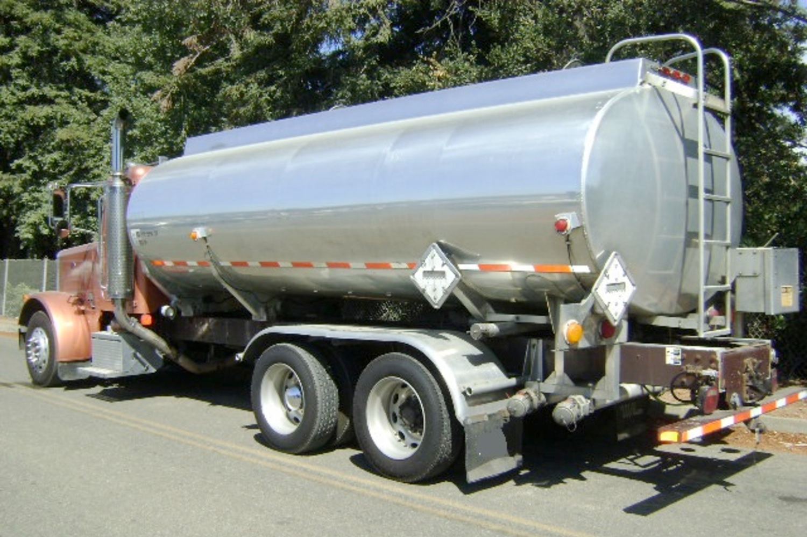

##***<u>Lesson 1: Water Usage</u>***

###**Objective:**
Students will compare and contrast an official data set versus a Participatory Sensing data set. They will
begin to analyze an official data set from 2010 provided by the Los Angeles Department of Water and
Power (DWP) to help them understand how water was used in the Los Angeles area in the recent past,
before the drought.

###**Materials:**
1. *Video: California Drought Crisis Reaches Worst Level as It Spreads North*  [https://www.nbcnews.com/storyline/california-drought/california-drought-crisis-reaches-worst-level-it-spreads-north-n169516](https://www.nbcnews.com/storyline/california-drought/california-drought-crisis-reaches-worst-level-it-spreads-north-n169516 "https://www.nbcnews.com/storyline/california-drought/california-drought-crisis-reaches-worst-level-it-spreads-north-n169516")

    OR [http://web.archive.org/web/20170505192356/http://www.nbcnews.com/storyline/california-drought/california-drought-crisis-reaches-worst-level-it-spreads-north-n169516](http://web.archive.org/web/20170505192356/http://www.nbcnews.com/storyline/california-drought/california-drought-crisis-reaches-worst-level-it-spreads-north-n169516 "http://web.archive.org/web/20170505192356/http://www.nbcnews.com/storyline/california-drought/california-drought-crisis-reaches-worst-level-it-spreads-north-n169516")
    
	
<iframe width="420" height="315"
	src="https://www.nbcnews.com/news/embedded-video/mmvo42767429933" allowfullscreen>
	</iframe> <a href="https://www.nbcnews.com/news/embedded-video/mmvo42767429933">https://www.nbcnews.com/news/embedded-video/mmvo42767429933</a>

2. *Webpage: Twitter vs. Heart Disease* Webpage (Found at:   [https://www.medicaldaily.com/how-twitter-can-predict-heart-disease-negative-tweets-associated-stress-higher-risk-318830](https://www.medicaldaily.com/how-twitter-can-predict-heart-disease-negative-tweets-associated-stress-higher-risk-318830 "https://www.medicaldaily.com/how-twitter-can-predict-heart-disease-negative-tweets-associated-stress-higher-risk-318830") 
)

3. Class Created Campaign Information (from [Unit 3](../unit3/overview.md), [Lessons 17](../unit3/lesson17.md)-[19](../unit3/lesson19.md))

###**Vocabulary:**
census

###**Essential Concepts:**

!!! note "Essential Concepts: "
    Data can be used to make predictions. Official data sets rely on censuses or random
    samples and can be used to make generalizations. On the other hand, data from Participatory Sensing
    campaigns are not random and rely on the sensors, in our case, humans, to be gathered and limits the ability to
    generalize.

###**Lesson:**
1. Ask students to recall that statistics are used to make predictions about population parameters.

2. Project the map found on the Medical Daily website. Inform students that Twitter data was
compared to CDC heart disease deaths data on side-by-side maps. Using a *Think, Pair, Share*
ask students to discuss:

    100. What is the source of the data on each map? ***A: Tweets as predicted by Twitter
    and heart attacks as listed on a death certificate and recorded by the CDC.***

    100. What do the colors on the map mean? ***A: On the spectrum from green to red,
    green means fewer deaths by heart attack and red means a greater number of
    deaths by heart attacks.***

    100. How are the maps the same? How are they different?

    100. How reliable are the methods used to report these data? ***A: In the case of the CDC
    data, we have verifiability (death certificates). On the other hand, the Twitter
    data predicts based on a person’s word.***

    100. How scalable are the methods and can they be generalized? ***A: Official data sets
    are usually censuses or random samples; they address things at a high level.
    Participatory Sensing or, in this case the Twitter data, is not random, but
    addresses things at a personal or local level; however, because it is not a
    census nor a random sample, it is difficult to be precise about uncertainty or
    ability to generalize.***

3. Quickly share student responses to the discussion. Then, inform them that this unit focuses on
data to make predictions.

4. Set the context for the next three lessons. Inform students that they will be delving into the topic
of water usage. In California, water usage is extremely important, given that the state has been in
an exceptional drought in the second decade of the 21st century.

5. Using the K-L-W strategy in their DS journals, give students a couple of minutes to write what
they *Know* about droughts. Then, students will write what they *Learned* about the California
drought as they watch the brief NB News video clip titled *California Drought Crisis Reaches Worst
Level as It Spreads North*. Finally, they will write 2-3 questions about what they *Want* to
know/learn about droughts. Video clip is found at: [https://www.nbcnews.com/storyline/california-drought/california-drought-crisis-reaches-worst-level-it-spreads-north-n169516](https://www.nbcnews.com/storyline/california-drought/california-drought-crisis-reaches-worst-level-it-spreads-north-n169516 "https://www.nbcnews.com/storyline/california-drought/california-drought-crisis-reaches-worst-level-it-spreads-north-n169516").

6. Do a quick *Whip Around* to share some of the students’ responses to the *K-L-W*.

7. Inform students that they will be learning about water usage in their own neighborhoods. The
LADWP data provides information at a high level about some (most) neighborhoods in L.A.
Students will investigate how they can learn more using participatory sensing. In statistics, the
Data Cycle provides a process by which we can learn about or investigate a particular topic of
interest. To review the components of the Data Cycle, give students two minutes to Quick Sketch
each phase of the cycle in their DS Journals.

8. After students have had an opportunity to do their sketches, display the Data Cycle graphic below
to review it:

    

9. Next, review their class created campaign from [unit 3](../unit3/overview.md). Using a Pair-Share strategy, ask students
to discuss when a Participatory Sensing campaign should be used rather than a survey. ***A:
Answers will vary. Research questions that include variation across time or across
locations are good candidates for Participatory Sensing campaigns; therefore, a <u>trigger</u> is
necessary in order to record observations at multiple time points and locations. If a
questions needs to be answered only once, then a survey is a better method.***

10. Remind students that in the last unit, they created one campaign for the entire class. In this unit,
each student team will be creating and implementing a campaign on the topic of water usage.

11. Before they start creating their campaign, they are going to explore an official data set provided
by the Los Angeles Department of Water and Power or DWP to learn more about water usage in
the Los Angeles area. Some students may receive services from the DWP.

12. Explain how the data were collected:

    * The data you will see reflects the water usage in Los Angeles in the fiscal year that
    began in 2010 (July 2010-June 2011). At this time, L.A. was entering a drought, but
    water conservation efforts had not yet begun.

    * The DWP supplies water to businesses and addresses within its boundaries. It records
    the amount of water delivered to each address each month. For privacy purposes, it
    doesn't report how much water a single address uses.

    * Instead, it combines these into neighborhoods. These neighborhoods are defined by the
    U.S. Census and called Census Blocks. A census block is usually one, sometimes two,
    square blocks.

    * The DWP reports separate water usage figures for businesses, government structures
    (such as schools), and residences. For privacy purposes, this data set eliminated any
    Census Block that had fewer than 15 addresses.

    * Water use is reported in Hundreds of Cubic Feet (HCF) per month (one HCF is about 748
    gallons). Display the picture below, which shows a truck that holds about 6 HCF, so
    students can get a sense of the amount of water as reported.

    

13. Load and display the DWP data set in RStudio using the command **data(dwp_2010)**. Then,
expand the spreadsheet () and explain what each variable in the data set means (they may
want to record these in their DS journals):

    100. census = census block

    100. sector_type = category of facility

    100. longitude, latitude = GPS coordinates for center of census block location

    100. census_pop = population of census block (number of water users)

    100. total = total number of HFCs used by sector type per block in 2010

    100. july through june = number of HFCs used by sector type per 
    
    100. count = number of facilities per census block for that sector type

14. Next, load an interactive map of the DWP 2010 data by visiting: 
    [http://gh.IDSucla.org/ids_labs/extras/animations/watermap/watermap.html](http://gh.IDSucla.org/ids_labs/extras/animations/watermap/watermap.html "http://gh.IDSucla.org/ids_labs/extras/animations/watermap/watermap.html")

15. Lead a discussion about what is on the page. Ask:

    100. What do the colors and percentages on the legend mean?

    100. What trends do you see?

16. Then click on a marker (circle) to show the popup. Ask:

    100. What information is the popup displaying?

    100. How is the popup displaying the information?

17. Then, click on the Size by census_pop circle under the legend. Ask:

    100. What do you notice about the markers?

    100. What is the size of each marker telling us?

    100. What else do you see?

18. Now that they know what the variables mean, ask student teams to generate a two statistical
questions about the data. Below are three examples of possible statistical questions:

    100. What month uses the most water?

    100. Typically, how much water do residences consume during that month?

    100. Does this change if you factor in the number of people living in that census block?

19. If time permits, conduct a share-out of the teams’ statistical questions.

###**Class Scribes:**
One team of students will give a brief talk to discuss what they think the 3 most important topics of the
day were.