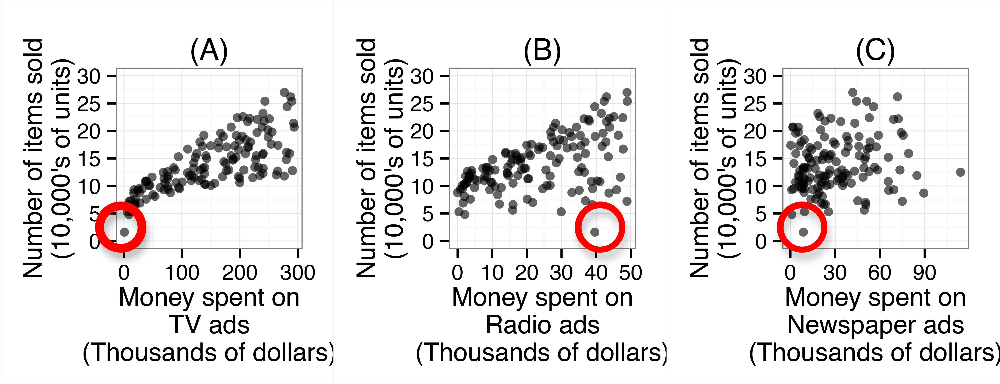
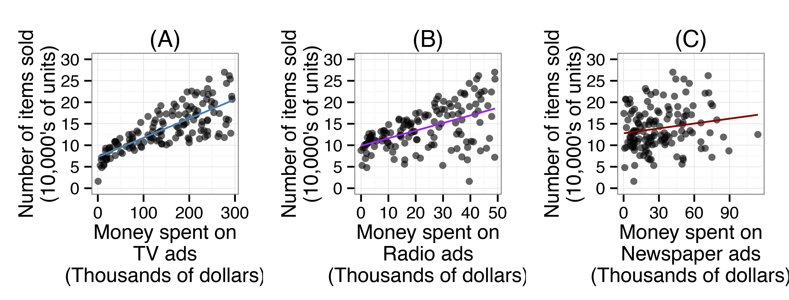

##***<u>Lesson 12: More Variables to Make Better Predictions</u>***

###**Objective:**
Students will see that information from different variables can be used together to create linear models
that make more accurate predictions.

###**Materials:**
1. *Advertising Plots Part 1* handout ([LMR_4.12_Advertising Plots 1](../IDS_Curriculum_v_5.0/2_IDS_LMRs_v_5.0/IDS_LMR_Unit 4_v_5.0/LMR_4.12_Advertising Plots 1.pdf))

2. *Advertising Plots Part 2* handout ([LMR_4.13_Advertising Plots 2](../IDS_Curriculum_v_5.0/2_IDS_LMRs_v_5.0/IDS_LMR_Unit 4_v_5.0/LMR_4.13_Advertising Plots 2.pdf))

3. *Article: How Long Can a Spinoff Like ‘Better Call Saul’ Last?* 
    [http://fivethirtyeight.com/features/how-long-can-a-spinoff-like-better-call-saul-last/](http://fivethirtyeight.com/features/how-long-can-a-spinoff-like-better-call-saul-last/ "http://fivethirtyeight.com/features/how-long-can-a-spinoff-like-better-call-saul-last/")

###**Vocabulary:**
market

###**Essential Concepts:**

!!! note "Essential Concepts: "
    We can use scatterplots to assess which variables might lead to strong predictive models.
    Sometimes using several predictors in one model can produce stronger models.

###**Lesson:**
1. Remind students that models are used to make predictions. Ask a volunteer to think of a TV show
that had a “spinoff” and to name both of the shows. Ask if he/she knows whether or not the
original was more or less successful than the spinoff. Then, ask the class: Is there a way to
predict spinoff success?

2. Next, using the *Talking to the Text* instructional strategy, ask students to read the article titled:
*How Long Can a Spinoff Like Better Call Saul Last?*

    **<u>Note:</u>** If this is the first time using this strategy with your students, make sure you model/explain it
    before they begin reading it. See [Instructional Strategies](../IDS_Curriculum_v_5.0/4_IDS_Teacher Resources_v_5.0/TR_Instructional Strategies.pdf) in [Teacher Resources](../download/resources.md) for a description.

3. After reading the article, ask students to discuss three *Talking to the Text* responses with a
partner. You may set a time limit for each student to share with his/her partner.

4. Then, in teams, students will answer the following questions pertaining to the article:

    100. What is the article trying to predict?
    
    100. How many variables are used?

    100. What other variables might affect a spinoff?

    100. The dotted line in the plot is not a regression line. How would you draw a regression line
    to make predictions?

    100. What other information would you like to know to predict a spinoff’s success?

5. Allow students time to discuss and record their answers. Then conduct a share out of their
responses to the discussion questions.

6. Discuss the following questions with the class:

    100. What effect does advertising have on retail sales?

    100. Where do stores advertise (What mediums do they use)? Does each method of
    advertisement reach the same people?

    100. Does each method of advertisement have a similar effect? Or are some methods more
    effective than others?

7. Distribute the 3 plots from the *Advertising Plots Part 1* handout ([LMR_4.12](../IDS_Curriculum_v_5.0/2_IDS_LMRs_v_5.0/IDS_LMR_Unit 4_v_5.0/LMR_4.12_Advertising Plots 1.pdf)) and inform the
students about the data using the details below:

    
*(Plots are presented separately in the LMR)*

    
<iframe src="https://docs.google.com/viewerng/viewer?url=https://curriculum.idsucla.org/IDS_Curriculum_v_5.0_preview/2_IDS_LMRs_v_5.0/IDS_LMR_Unit 4_v_5.0/LMR_4.12_Advertising Plots 1.pdf&embedded=true" style=" width:420px;height:400px;" frameborder="0"></iframe> [LMR_4.12](../IDS_Curriculum_v_5.0/2_IDS_LMRs_v_5.0/IDS_LMR_Unit 4_v_5.0/LMR_4.12_Advertising Plots 1.pdf)

    100. These 3 plots show the number of items sold by a retailer (in 200 different markets) and
    the amount of money the company spent on TV, Radio and Newspaper advertisements.

    100. The data has 200 observations, one for each different market. A **market** is simply a
    location where an item is sold. For example, Los Angeles and San Francisco are two
    different markets.

    100. Each observation has 4 variables: (1) The number of items sold (in 10’s of thousands of
    units), (2) the money spent on TV ads (in thousands of dollars), (3) the money spent on
    radio ads (in thousands of dollars), and (4) the money spent on newspaper ads (in
    thousands of dollars).

    100. The data were collected using an observational study.

8. To illustrate a-d above, ask students to refer to plot A (TV ads) and circle the market in which this
retailer sold the least number of items (see circles in plots above). Ask: How many items did this
market sell? ***About 20,000 items. actual number of items sold was 1.6 (in 10,000’s of units)
which is 16,000 items.*** How much money did this retailer spend on TV ads in this market? ***This
retailer spent zero dollars on TV ads. The actual amount the retailer spent on TV ads was
0.7 thousands of dollars, which is $700.***

9. Students should then refer to plot B (Radio ads), find the same market (the one in which the
retailer sold about 20,000 items) and circle it. Ask: How much money did the retailer spend on
Radio ads in the same market? ***About 40 thousand dollars. The actual amount spent on
Radio ads was 39.6 thousands of dollars, which is $39,600.***

10. Finally, ask students to refer to plot C (Newspaper ads), find the same market (the one in which
the retailer sold about 20,000 items), and circle it. Ask: How much money did the retailer spend
on Newspaper ads in the same market? ***About 10 thousand dollars. About The actual amount
spent on Newspaper ads is 8.7 thousands of dollars, which is $8,700***

    

11. Based on the above plots, use a Pair-Share to discuss the following:

    100. Describe the relationship between advertisements and the number of items sold.

    100. Which type of advertisement is the most strongly correlated with the number of units
    sold? How can you tell?

12. Distribute the *Advertising Plots Part 2* handout ([LMR_4.13_Advertising Plots 2](../IDS_Curriculum_v_5.0/2_IDS_LMRs_v_5.0/IDS_LMR_Unit 4_v_5.0/LMR_4.13_Advertising Plots 2.pdf)), which contains
plots A-C, but now include the line of best fit.

    
*(Plots are presented separately in the LMR)*

    
<iframe src="https://docs.google.com/viewerng/viewer?url=https://curriculum.idsucla.org/IDS_Curriculum_v_5.0_preview/2_IDS_LMRs_v_5.0/IDS_LMR_Unit 4_v_5.0/LMR_4.13_Advertising Plots 2.pdf&embedded=true" style=" width:420px;height:400px;" frameborder="0"></iframe> [LMR_4.13](../IDS_Curriculum_v_5.0/2_IDS_LMRs_v_5.0/IDS_LMR_Unit 4_v_5.0/LMR_4.13_Advertising Plots 2.pdf)

13. Ask students to recall from [Lesson 6](lesson6.md) that a method statisticians use to figure out which predicted
values is closest to the actual data is the mean absolute error (MAE).

    **<u>Note to teacher:</u>** In the labs, students will use the mean squared error (MSE) - also learned in
    [Lesson 6](lesson6.md) - which calculates the regression line. In the lessons, we discuss the issue more
    generally using the mean absolute error (MAE).

14. In teams, ask students to discuss the following:

    100. How would you use the mean absolute error to determine which plot would make the
    most accurate predictions? ***Answers will vary, but you would expect to hear
    something like: “the prediction line that has the least amount of distance to all the
    points on the plot would make the most accurate prediction because the predicted
    values will be closer to the actual data.”***

15. Next, have students select a statement they think is best (a or b), then write a justification for their
selection based on what they learned in this lesson. This they may completed as homework.

    100. Combining multiple variables (e.g., TV and Newspaper ads, TV and Radio ads, TV,
    Radio, and Newspaper ads, etc.) into one model will lead to worse predictions because
    the variables that make poor predictions will contaminate those that make good
    predictions.

    100. Combining multiple variables (e.g., TV and Newspaper ads, TV and Radio ads, TV,
    Radio, and Newspaper ads, etc.) into one model will lead to better predictions because
    the model can use more information to make predictions.

16. Inform students that RStudio has the capability of creating models that combine multiple variables
to make predictions about another variable. For example, it can make a model to predict number
of items sold using both money spent on TV and money spent on Newspaper ads. Students will
learn more about it during the [next lesson](lesson13.md).

###**Class Scribes:**
One team of students will give a brief talk to discuss what they think the 3 most important topics of the
day were.

###
**Homework**

Students may continue writing their justifications for the selected statement in item 15 if they were unable
to finish.