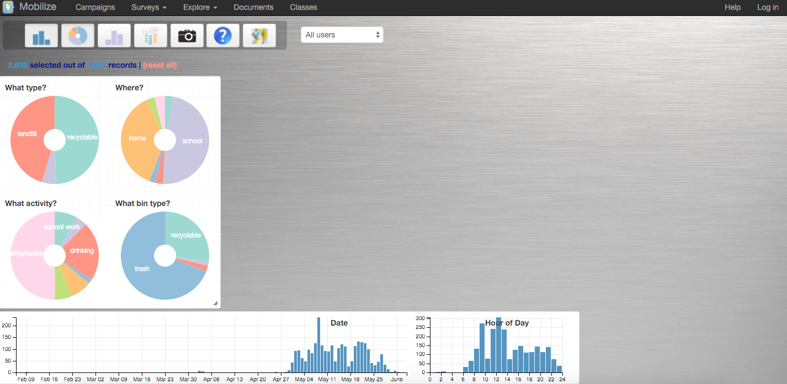

##***<u>Lesson 15: The Growth of Landfills</u>***

###**Objective:**
Students will engage in a modeling activity to about reducing the burden of trash landfills.

###**Materials:**
1. *Landfill Article* handout ([LMR_4.15_Landfill Article](../IDS_Curriculum_v_5.0/2_IDS_LMRs_v_5.0/IDS_LMR_Unit 4_v_5.0/LMR_4.15_Landfill Article.pdf))

2. *Landfill Readiness Questions* handout ([LMR_4.16_Landfill Readiness Questions](../IDS_Curriculum_v_5.0/2_IDS_LMRs_v_5.0/IDS_LMR_Unit 4_v_5.0/LMR_4.16_Landfill Readiness Questions.pdf))

3. *Landfill Activity* handout ([LMR_4.17_Landfill Activity](../IDS_Curriculum_v_5.0/2_IDS_LMRs_v_5.0/IDS_LMR_Unit 4_v_5.0/LMR_4.17_Landfill Activity.pdf))

4. Computers

5. IDS public dashboard: [https://tools.idsucla.org](https://tools.idsucla.org "https://tools.idsucla.org")

6. *Trash Data Exploration* handout ([LMR_4.18_Trash Data Exploration](../IDS_Curriculum_v_5.0/2_IDS_LMRs_v_5.0/IDS_LMR_Unit 4_v_5.0/LMR_4.18_Trash Data Exploration.pdf))

###**Essential Concepts:**

!!! note "Essential Concepts: " 
    Modeling does not always have to produce an equation. Instead, we can create
    models to answer real-world problems related to our community.

###**Lesson:**
1. Inform students that they will investigate a problem that faces many cities in the United States
today: trash. Explain that the next 4 days will be dedicated to completing the investigation and will
follow this general structure:

    100. Day 1: Introduce assignment, initial exploration of data, creation of statistical questions.

    100. Day 2: Analysis of data via the IDS public dashboard.

    100. Day 3: Verify analysis via RStudio.

    100. Day 4: Team presentations.

2. Distribute the Landfill Article handout ([LMR_4.15_Landfill Article](../IDS_Curriculum_v_5.0/2_IDS_LMRs_v_5.0/IDS_LMR_Unit 4_v_5.0/LMR_4.15_Landfill Article.pdf)) and explain that the reading is
an excerpt from a CNN article titled *Trash City: Inside America’s Largest Landfill Site*. The article
will set the context for the real-world problem of growing landfills.

<iframe src="https://docs.google.com/viewerng/viewer?url=https://curriculum.idsucla.org/IDS_Curriculum_v_5.0_preview/2_IDS_LMRs_v_5.0/IDS_LMR_Unit 4_v_5.0/LMR_4.15_Landfill Article.pdf&embedded=true" style=" width:420px;height:400px;" frameborder="0"></iframe> [LMR_4.15_Landfill Article](../IDS_Curriculum_v_5.0/2_IDS_LMRs_v_5.0/IDS_LMR_Unit 4_v_5.0/LMR_4.15_Landfill Article.pdf)

3. Using the *5 Ws* strategy, ask students to read the article individually and to write down the 5 Ws
in their DS journals. The 5 Ws summarize the What, Who, Why, When, and Where of the article.

4. After they have finished reading, students should answer the questions provided on the *Landfill
Readiness Questions* handout ([LMR_4.16_Landfill Readiness Questions](../IDS_Curriculum_v_5.0/2_IDS_LMRs_v_5.0/IDS_LMR_Unit 4_v_5.0/LMR_4.16_Landfill Readiness Questions.pdf)). Then, in teams,
students will discuss their insights, questions, and/or reactions to the both the article and the
questions. Follow up the team discussion with a class discussion to gauge what students actually
know about trash and recycling.

<iframe src="https://docs.google.com/viewerng/viewer?url=https://curriculum.idsucla.org/IDS_Curriculum_v_5.0_preview/2_IDS_LMRs_v_5.0/IDS_LMR_Unit 4_v_5.0/LMR_4.16_Landfill Readiness Questions.pdf&embedded=true" style=" width:420px;height:400px;" frameborder="0"></iframe> [LMR_4.16](../IDS_Curriculum_v_5.0/2_IDS_LMRs_v_5.0/IDS_LMR_Unit 4_v_5.0/LMR_4.16_Landfill Readiness Questions.pdf)

5. Next, introduce students to the main task they will be investigating about landfills by distributing
the *Landfill Activity* handout ([LMR_4.17_Landfill Activity](../IDS_Curriculum_v_5.0/2_IDS_LMRs_v_5.0/IDS_LMR_Unit 4_v_5.0/LMR_4.17_Landfill Activity.pdf)). This handout asks the students to come
up with one or two recommendations to help reduce the burden of landfills on the environment. In
order to complete the assignment, students will use 2 data analysis tools: the IDS dashboard and
RStudio.

<iframe src="https://docs.google.com/viewerng/viewer?url=https://curriculum.idsucla.org/IDS_Curriculum_v_5.0_preview/2_IDS_LMRs_v_5.0/IDS_LMR_Unit 4_v_5.0/LMR_4.17_Landfill Activity.pdf&embedded=true" style=" width:420px;height:400px;" frameborder="0"></iframe> [LMR_4.17](../IDS_Curriculum_v_5.0/2_IDS_LMRs_v_5.0/IDS_LMR_Unit 4_v_5.0/LMR_4.17_Landfill Activity.pdf)

6. Once all students have read the assignment, use the following questions to check for
understanding of what the task is:

    100. What organization is asking for your help? ***The Los Angeles County Sanitation District
    (LACSD).***

    100. What type of data did the organization collect, and whom did they collect it from?
    ***Participatory Sensing data via the Trash campaign. The campaign was city-wide
    and taken by high school students in LAUSD.***

    100. How many recommendations will you present to the organization? ***One or two.***

    100. What does the organization hope to do with your recommendations? ***Create a public
    awareness campaign to help reduce the burden on landfills.***

7. At this point, students will begin exploring the data via the IDS public dashboard:
[https://tools.idsucla.org](https://tools.idsucla.org "https://tools.idsucla.org")

8. They should use the “Trash” campaign data and select “Dashboard” from the “Action” button.

9. The dashboard is a visual tool for exploring and analyzing data. An example screenshot of the
Trash campaign in the dashboard is shown below.

10. Students do not need to complete any analyses during today’s lesson. Instead, they should
simply “play” with the data and brainstorm possible statistical questions that will help them
complete the activity.

11. To assist students’ interaction with the dashboard, distribute the *Trash Dashboard Exploration*
handout ([LMR_4.18_Trash Data Exploration](../IDS_Curriculum_v_5.0/2_IDS_LMRs_v_5.0/IDS_LMR_Unit 4_v_5.0/LMR_4.18_Trash Data Exploration.pdf)).

<iframe src="https://docs.google.com/viewerng/viewer?url=https://curriculum.idsucla.org/IDS_Curriculum_v_5.0_preview/2_IDS_LMRs_v_5.0/IDS_LMR_Unit 4_v_5.0/LMR_4.18_Trash Data Exploration.pdf&embedded=true" style=" width:420px;height:400px;" frameborder="0"></iframe> [LMR_4.18](../IDS_Curriculum_v_5.0/2_IDS_LMRs_v_5.0/IDS_LMR_Unit 4_v_5.0/LMR_4.18_Trash Data Exploration.pdf)

12. Leave 10-15 minutes at the end of class to share out and discuss some of these statistical
questions. During this time, the teacher should also check for data understanding.

###**Class Scribes:**
One team of students will give a brief talk to discuss what they think the 3 most important topics of the
day were.