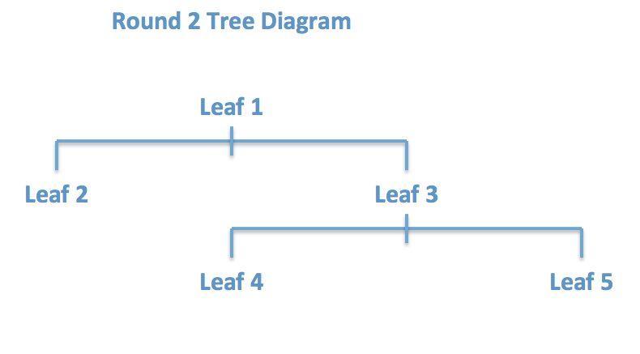
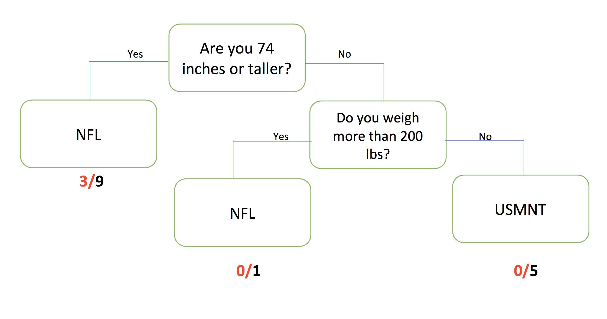

##***<u>Lesson 18: Grow Your Own Decision Tree</u>***

###**Objective:**
Students will learn what decision trees look like and how they can be used to classify people or objects
into groups. They will engage in an activity to see how making slight changes to the tree can lead to
drastic rises or reductions in misclassifications.

###**Materials:**
1. *CART Activity Player Stats* ([LMR_4.19_CART Player Stats](../IDS_Curriculum_v_5.0/2_IDS_LMRs_v_5.0/IDS_LMR_Unit 4_v_5.0/LMR_4.19_CART Player Stats.pdf))

2. *CART Activity Round 1 Questions* ([LMR_4.20_CART Round 1](../IDS_Curriculum_v_5.0/2_IDS_LMRs_v_5.0/IDS_LMR_Unit 4_v_5.0/LMR_4.20_CART Round 1.pdf))

3. *CART Activity Round 2 Questions* ([LMR_4.21_CART Round 2](../IDS_Curriculum_v_5.0/2_IDS_LMRs_v_5.0/IDS_LMR_Unit 4_v_5.0/LMR_4.21_CART Round 2.pdf))

    **Advanced preparation required** (see Step 8 below)

###**Vocabulary:**
classify, decision tree, Classification and Regression Trees (CART), nodes, misclassifications

###**Essential Concepts:**

!!! note "Essential Concepts: " 
    Some trends are not linear, so the approaches we’ve done so far won’t be helpful.
    We need to model such trends differently. Decision trees are a non-linear tool for classifying observations
    into groups when the trend is non-linear.

###**Lesson:**
1. Inform students that, during today’s lesson, they will be participating in an activity to try to
**classify** professional athletes into one of two groups: (1) soccer players on the US Men’s
National Team, OR (2) football players in the National Football League (NFL).

2. Remind students that this unit has focused on linear models and making predictions. In the real
world, data can be modeled in a variety of ways, many of which are non-linear, and because of
this, we can’t easily write down a mathematical equation to help up make predictions. However,
we can use what we have learned so far to determine whether or not other models can provide a
good fit to the data.

3. Introduce the topic of **decision trees** and explain that it is simply a non-linear way to model data.

4. Explain that decision trees are “grown” by using algorithms, or rules, to test many, many different
decision trees to find the one that makes the best predictions.

5. A decision tree is basically a series of questions that are asked sequentially. Observations start
by answering the first question (at the root of the tree), and then proceed along the different
branches based on the answers they give to the questions that follow. At the end, based on all of
the questions asked, observations are then classified as one of k classifications.

6. Remind students that algorithms are a series of steps that are repeated a large number of times.
For decision trees, this enables us to (1) explore many possible paths, beginning from the same
initial point, or (2) find different starting points based on where we ended during the previous
iteration.

7. Ask students to recall that they created and worked with *linear models* earlier in the unit. We are
continuing our work with models and will learn another method of modeling called **CART**, which
stands for **Classification and Regression Trees**. This is another name for decision trees.

8. CART Activity: to get a sense of how decision trees work, the students will see one in action. We
are going to try to classify 15 professional athletes into either soccer or football players based on
some of their characteristics.

    **<u>Note:</u>** Advanced preparation required. The cards in each of the LMRs listed above (and displayed
    below) need to be cut out prior to class time.

    
<iframe src="https://docs.google.com/viewerng/viewer?url=https://curriculum.idsucla.org/IDS_Curriculum_v_5.0_preview/2_IDS_LMRs_v_5.0/IDS_LMR_Unit 4_v_5.0/LMR_4.19_CART Player Stats.pdf&embedded=true" style=" width:420px;height:400px;" frameborder="0"></iframe> [LMR_4.19](../IDS_Curriculum_v_5.0/2_IDS_LMRs_v_5.0/IDS_LMR_Unit 4_v_5.0/LMR_4.19_CART Player Stats.pdf)

    
<iframe src="https://docs.google.com/viewerng/viewer?url=https://curriculum.idsucla.org/IDS_Curriculum_v_5.0_preview/2_IDS_LMRs_v_5.0/IDS_LMR_Unit 4_v_5.0/LMR_4.20_CART Round 1.pdf&embedded=true" style=" width:420px;height:400px;" frameborder="0"></iframe> [LMR_4.20](../IDS_Curriculum_v_5.0/2_IDS_LMRs_v_5.0/IDS_LMR_Unit 4_v_5.0/LMR_4.20_CART Round 1.pdf)

    
<iframe src="https://docs.google.com/viewerng/viewer?url=https://curriculum.idsucla.org/IDS_Curriculum_v_5.0_preview/2_IDS_LMRs_v_5.0/IDS_LMR_Unit 4_v_5.0/LMR_4.21_CART Round 2.pdf&embedded=true" style=" width:420px;height:400px;" frameborder="0"></iframe> [LMR_4.21](../IDS_Curriculum_v_5.0/2_IDS_LMRs_v_5.0/IDS_LMR_Unit 4_v_5.0/LMR_4.21_CART Round 2.pdf)

9. Ask for 15 volunteers and hand each of them a data card from the *CART Activity Player Stats*
handout ([LMR_4.19](../IDS_Curriculum_v_5.0/2_IDS_LMRs_v_5.0/IDS_LMR_Unit 4_v_5.0/LMR_4.19_CART Player Stats.pdf)). These students will be known as the “players.” Each card lists the following
variables for 15 different professional athletes:

    a. team location

    b. name

    c. age

    d. height (in inches)

    e. weight (in pounds)

    f. league

10. The “players” will only be allowed to say “yes” or “no” in this activity. No other talking is permitted.

11. Now, ask for 7 additional volunteers to be the ***nodes***, or *leaves*, on the decision tree. Each
student will be known as a “leaf.”

12. Distribute one question/classification from the *CART Activity Round 1 Questions* ([LMR_4.20](../IDS_Curriculum_v_5.0/2_IDS_LMRs_v_5.0/IDS_LMR_Unit 4_v_5.0/LMR_4.20_CART Round 1.pdf)) to
each “leaf.”

13. Arrange the 7 “leaves” in the room as depicted by the graphic below:

14. Now, each “player,” one at a time, will approach *Leaf 1*, who will ask the “player” the question
listed on his/her card. Depending on the player’s answer, *Leaf 1* will direct the “player” to the next
“leaf.”

15. The “player” continues through the nodes until a “leaf” declares the “player” to be either (1) a
soccer player on the US Men’s National Team, OR (2) a football player in the National Football
League (NFL).

16. Allow all the “players” to go through the “leaves” until each one is classified as either a soccer or
football player.

17. After each player has been classified, tally the number of correct and incorrect classifications and
display a simple table (see example below) on the board.

    | |**Classified Correctly**| **Classified Incorrectly**|
    |------|------|------|
    |**USMNT Soccer Player**| ?| ?|
    |**NFL Football Player**| ?| ?| 

18. Ask students to calculate the misclassification rate (MCR) which is the proportion of observations
who were predicted to be in one category but were actually in another. If all the activity player
stats cards were used, the misclassification rate would be 5/15.

19. After proceeding through “Round 1,” ask an additional 5 students to come up as more “leaves,”
distribute the cards from the CART Activity Round 2 Questions file ([LMR_4.21](../IDS_Curriculum_v_5.0/2_IDS_LMRs_v_5.0/IDS_LMR_Unit 4_v_5.0/LMR_4.21_CART Round 2.pdf)), and arrange the
students like the diagram below:

20. Have each “player” go through this new set of “leaves” until they are re-classified by these new
rules.

21. Again, tally the number of correct and incorrect classifications and display them on the board and
calculate the misclassification rate. If all the activity player stats cards were used, the
misclassification rate would be 3/15.

22. Once the activity has been completed, ask students the following questions:

    100. How do decision trees classify objects/people as being a member of a group? ***By asking
    a series of questions, one at a time, and sending the participant down a particular
    path until he/she is classified.***

    100. Did we do as well, worse, or better in Round 2 compared to Round 1 at correctly
    guessing which sport the “players” participate in? Explain. ***Answers will vary according
    to results of the activity.***

    100. How can we figure out what questions to ask and in what order to minimize the number of
    **misclassifications**? (This one might not be obvious. The point is for the students to
    wrestle with how they might think it can be done.)

23. Also have the students discuss the following questions:

    100. How is a decision tree/CART similar to or different than a linear model?
    
    100. Can we really call a decision tree a model? Why or why not?

24. In [lab 4G](lab4g.md) you will use RStudio to create tree models that will make good predictions without
needing a lot of branches. RStudio can also calculate the misclassification rate. However, you
might find the visual a little confusing to interpret, so we will use the Round 2 classification tree to
see what the output from RStudio might look like.

25. Project the image above and explain to the students that if all 15 of the activity player stats cards
were used, then RStudio would give ratios for each of the leaves where a classification was made.
The denominator tells us how many observations ended up in that leaf and the numerator tells us
the number of misclassifications. Ask students:

    100. What does the output 3/9 represent? ***Answer: The 9 tells us that nine players were
    classified as NFL players based solely on the fact that they were taller than 74
    inches. The 3 represents soccer players that were misclassified so 6 football
    players were classified correctly.***
    
    100. How would you calculate the misclassification rate (MCR)? ***Answer: You would add all
    of the numerators which represent the misclassifications and divide by the total
    number of observations which you could obtain by adding all the denominators.
    (3+0+0)/(9+1+5)=3/15.***

###**Class Scribes:**
One team of students will give a brief talk to discuss what they think the 3 most important topics of the
day were.

###
**Homework**

Students will record their responses to the following discussion questions about CARTs and submit them
the following day:

a. How is a decision tree/CART similar to or different than a linear model?

b. Can we really call a decision tree a model? Why or why not?