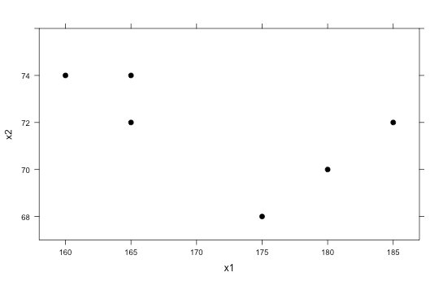
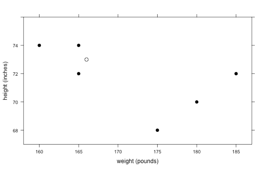
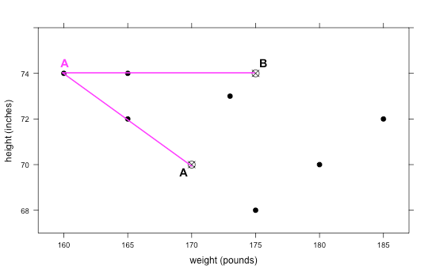
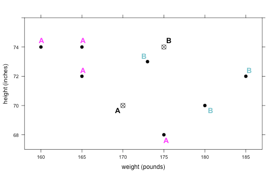

##***<u>Lesson 20: Where Do I Belong?</u>***

###**Objective:**
Students will learn what clustering is and how to classify groups of people into clusters based on
unknown similarities.

###**Materials:**
1. *Find the Clusters* handout ([LMR_4.24_Find the Clusters](../IDS_Curriculum_v_5.0/2_IDS_LMRs_v_5.0/IDS_LMR_Unit 4_v_5.0/LMR_4.24_Find the Clusters.pdf))

###**Vocabulary:**
clustering, cluster, k-means

###**Essential Concepts:**

!!! note "Essential Concepts: " 
    We can identify groups, or “clusters,” in data based on a few characteristics. For
    example, it is easy to classify a classroom into males and females, but what if you only knew each
    person’s arm span? How well could you classify their genders now?

###**Lesson:**
1. Inform the students that they will continue to explore different types of models, and today they will
be focusing on **clustering**. Clustering is the process of grouping a set of objects (or people)
together in such a way that people in the same group (called a **cluster**) are more similar to each
other than to those in other groups.

2. Have the students recall that, in the previous lessons, they used decision trees and CART to
classify people into different groups based on whether or not a person had a specific
characteristic (e.g., whether or not a professional athlete’s team is based in the US).

3. But, sometimes we don’t know what these specific characteristics are. We are simply given
numerical variables and asked to find similarities. This is where clustering comes in – similar
people will congregate towards each other, and we want to see if we can identify their groupings.

4. We will look at a very basic example first. Suppose the following 6 observations are given:

    | **Obs** | **X1** | **X2** |
    |-----|---------------|---------------|
    | 1 | 160 | 74 |
    | 2 | 165 | 72 |
    | 3 | 165 | 74 |
    | 4 | 175 | 68 |
    | 5 | 180 | 70 |
    | 6 | 185 | 72 |

5. Plot the X1 and X2 points on a scatterplot either on the board or on poster paper (X1 can be on the
horizontal axis and X2 can be on the vertical axis). The graph should look like the one below:

    

6. Ask students if they think there are any clusters, or groups, that stand out to them. It is likely that
they will say there are 2 clusters in the graph: the top left corner 3 points, and the bottom right 3
points.

7. Now pose the following scenario that further describes the data:

    100. A doctor provides yearly physicals to the men’s football and men’s swimming teams at a
    local high school.

    100. He has collected data over the past few years on each player’s weight (in pounds) and
    height (in inches). He informs us that weight was coded as the variable X1, and height
    was coded as the variable X2. You can re-label the scatterplot with this new information.

        

    100. Unfortunately, the doctor never recorded what sport each person played.

8. Using the information about height and weight, ask the students to decide:

    100. Which group of points most likely represents players from the swimming team? ***The
    points in the upper left corner are probably swimmers because swimmers are
    usually tall (and have large arm spans) and thin.***

    100. Which group of points most likely represents players from the football team? ***The points
    in the bottom right corner are probably football players because they tend to be
    heavier and more muscular.***

9. Now suppose a new player comes into the doctor’s office for a physical. His weight and height
are recorded as 166 pounds and 73 inches, respectively, but the doctor forgets to ask what sport
he plays. Plot this point on the graph and ask students to determine which sport they think this
student plays. ***This student is most likely a soccer player because he is tall and thin, and
his point is near the swimming cluster.***

10. That was an easy one! But what if a player comes in and has the following measurements: weight
= 173 pounds, height = 73 inches?

11. Distribute the *Find the Clusters* handout ([LMR_4.24](../IDS_Curriculum_v_5.0/2_IDS_LMRs_v_5.0/IDS_LMR_Unit 4_v_5.0/LMR_4.24_Find the Clusters.pdf)) and tell the students that the new point has
been added to the “Round 1” graph.

<iframe src="https://docs.google.com/viewerng/viewer?url=https://curriculum.idsucla.org/IDS_Curriculum_v_5.0_preview/2_IDS_LMRs_v_5.0/IDS_LMR_Unit 4_v_5.0/LMR_4.24_Find the Clusters.pdf&embedded=true" style=" width:420px;height:400px;" frameborder="0"></iframe> [LMR_4.24](../IDS_Curriculum_v_5.0/2_IDS_LMRs_v_5.0/IDS_LMR_Unit 4_v_5.0/LMR_4.24_Find the Clusters.pdf)

12. Ask students:

    100. On which team do you think this person plays? ***It is much more difficult to tell now
    because it looks like it is right in between the two clusters.***

13. In order to determine group placement, we can use an algorithm called **k-means clustering**.
With this method, we select k clusters that we want to identify. Since we know we only have 2
types of athletes, football players and swimmers, we will be finding k = 2 clusters.

14. To introduce the students to this idea, circle the 3 points in the upper left corner (the ones that are
likely the swimmers) and have students find the “mean point.” This means that they should find
the mean x-value and the mean y-value of the 3 points. They can then plot this new point and use
it as the mean of this particular group, or cluster.

15. The goal of this algorithm is to keep recalculating means as the possible clusters change. To
begin, we will randomly pick 2 arbitrary points on the plot (we can call them A and B) to be our
starting means for each cluster. There is no incorrect way to pick the starting means, but the
further away the means are from the actual points, the longer it will take the algorithm to complete.
If you would like to use the point found in Step 14 and label it as “A,” that is completely fine. You
can simply pick just one other random point and label it as “B.”

16. For now, we will start with the following two points as guesses for the means of each group: A:
(170, 70) and B: (175, 74). In the “Round 1” plot on the *Find the Clusters* handout, each student
should plot and label these two points.

    

17. Inform the students that they will be drawing lines from each original point to both means. Then,
they will decide if the point is closer to mean A or mean B and label the point with that letter.
Lines have been draw from the top left point to the means in the plot below as a guide. You can
draw this on the board as a reference for the students as well.

    

18. Since the line to point A is smaller, we would classify that point as being in cluster A (as shown
below).

    

19. The students should draw similar lines for every point on the graph and make a decision as to
which cluster each belongs in. They can simply eyeball it. Even if they guess incorrectly, the
algorithm should be able to find the correct groups after some time. The correct classifications for
Round 1 are as follows:

    

20. Once the class has agreed on the first round’s cluster classifications, they should compute new
values for the k-means (A and B). For mean A, they simply need to find the mean x-value for the
4 points and the mean y-value for the 4 points. The new means for A and B have been calculated
below. The students should be calculating these on their own and recording their new means on
the handout.

    x-value for A = (160 + 165 + 165 + 175)/4 = 166.25

    y-value for A = (74 + 72 + 74 + 68)/4 = 72

    x-value for B = (173 + 180 + 185)/3 = 179.3

    y-value for B = (73 + 70 + 72)/3 = 71.67

    new A = (166.25, 72)

    new B = (179.3, 71.67)

21. Have the students continue working through the handout until the cluster membership remains
the same between 2 consecutive rounds. This means that, from one iteration to the next, the
points in each cluster do not change.

###**Class Scribes:**
One team of students will give a brief talk to discuss what they think the 3 most important topics of the
day were.

###
**Homework & Next Day**

Write a paragraph that describes k-means clustering in your own words.

[<u>***LAB 4H: Finding Clusters***</u>](lab4h.md)

Complete [Lab 4H](lab4h.md) prior to [Lesson 21](lesson21.md).