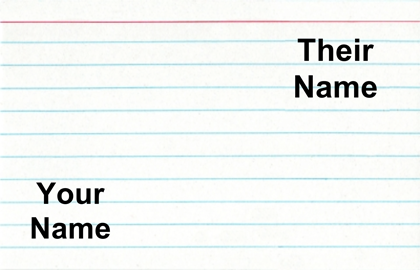
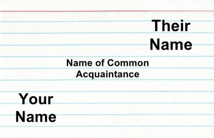

##***<u>Lesson 21: Our Class Network</u>***

###**Objective:**
Students will participate in an activity to map out their own network based on acquaintances between two
people.

###**Materials:**
1. *Friend Network Graphic* ([LMR_4.25_Friend Network Graphic](../IDS_Curriculum_v_5.0/2_IDS_LMRs_v_5.0/IDS_LMR_Unit 4_v_5.0/LMR_4.25_Friend Network Graphic.pdf))

2. Index cards

3. *Network Code* file ([LMR_4.26_Network Code R Script](../IDS_Curriculum_v_5.0/2_IDS_LMRs_v_5.0/IDS_LMR_Unit 4_v_5.0/LMR_4.26_Network Code R Script))

###**Vocabulary:**
network

###**Essential Concepts:**

!!! note "Essential Concepts: " 
    Networks are made when observations are interconnected. In a social setting, we
    can examine how different people are connected by finding relationships between other people in a
    network.

###**Lesson:**
1. Display the *Friend Network Graphic* ([LMR_4.25](../IDS_Curriculum_v_5.0/2_IDS_LMRs_v_5.0/IDS_LMR_Unit 4_v_5.0/LMR_4.25_Friend Network Graphic.pdf)), which shows a WolframAlpha visualization of
someone’s Facebook friends. Inform the students that this type of model is called a **network**,
which is simply a group of people or things that are interconnected in some way.

<iframe src="https://docs.google.com/viewerng/viewer?url=https://curriculum.idsucla.org/IDS_Curriculum_v_5.0_preview/2_IDS_LMRs_v_5.0/IDS_LMR_Unit 4_v_5.0/LMR_4.25_Friend Network Graphic.pdf&embedded=true" style=" width:420px;height:400px;" frameborder="0"></iframe> [LMR_4.25](../IDS_Curriculum_v_5.0/2_IDS_LMRs_v_5.0/IDS_LMR_Unit 4_v_5.0/LMR_4.25_Friend Network Graphic.pdf)

2. Ask the following questions about the graphic:

    100. What does each dot represent? ***Each dot represents one person.***

    100. What does each line represent? ***Each line represents a friendship between two
    people.***

    100. How are all the people in this graphic connected to each other? ***They are all friends
    with the person whose Facebook this is.***
    
    100. Why are some areas denser than others? ***A lot of people in the darker spots know
    each other, so there are more connections/friendships.***

    100. Why are some people not in groups at all (the dots at the edges of the graphic)? ***The
    main person does not have any friends in common with this person.***

    100. What might some of the groupings (the denser spots) represent? ***Answers will vary.
    Some examples include high school friends, college friends, graduate school
    friends, family members, or people who participate in similar hobbies.***

3. Ask the students what other types of social networks, other than Facebook, they belong to?
Responses will most likely include Twitter, Instagram, Snapchat, LinkedIn, Google+, etc.

4. Next, inform the students that networks can be as big or as small as we want. We can even
determine our own class’s social network and create visualizations from it!

5. Network Activity:

    100. Distribute index cards to students. Each student will need enough cards to make a
    connection with every other person in the class. For example, if there are 20 students in a
    class, then each student needs 19 cards.

    100. On EVERY index card, the student should write his/her first AND last name in the lower
    left-hand corner (see image below).

        

    100. Next, each student will walk around the classroom and put another student’s first AND
    last name in the top right-hand corner of an index card (see image below).

        

    100. In the center of the index card, the students should write the name of the closest 3rd
    person that they BOTH know (see image below). The person can be someone in the
    class, someone outside of the class, or someone who doesn’t even attend the same
    school.

        

    100. Once all of the students have completed their cards, they will turn them in to the teacher
    so the teacher can create a visualization of the network.

    100. This will probably take an entire class period to complete, which is fine because the
    graphics can be created and shown the next day.

6. At this point, the teacher will need to manually input the data from the index cards into a
spreadsheet. ***It is recommended that the spreadsheet be saved as a .csv file.*** Two sample
index cards are included, along with how you would input the data.

    

    **<u>Note:</u>** The first index card corresponds to rows 1 and 2 in the spreadsheet (the purple box). The
    second index card corresponds to rows 3 and 4 in the spreadsheet (the pink box). So, each card
    will take up two rows in the spreadsheet.

    **<u>Note:</u>** It is probably best to input the data after class and present the visualization during the next
    day.

7. Once all data has been input into a spreadsheet, use the code provided in the *Network Code* file
([LMR_4.26](../IDS_Curriculum_v_5.0/2_IDS_LMRs_v_5.0/IDS_LMR_Unit 4_v_5.0/LMR_4.26_Network Code R Script)) to produce graphs for the class’s social network.

    **<u>Note:</u>** The R Script file can be opened and viewed in the “source” pane of RStudio. There are 2
    places where the code needs to be edited by the teacher:

    100. Be sure to change the file name when reading in the .csv file in Line 7 of the code.
    
    100. Read the comments in Lines 91-96 to help find the 5 most popular people in the class’s
    network. This may require some edits to Lines 97 and 108

        

###**Class Scribes:**
One team of students will give a brief talk to discuss what they think the 3 most important topics of the
day were.

###
**Next Day**

Students will end their water usage campaign data collection after today’s lesson. Starting the next day,
they will analyze their data as part of the [End of Unit 4 project](end.md).