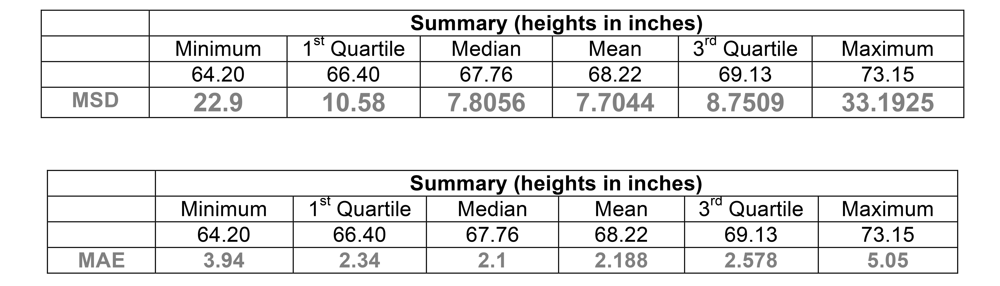
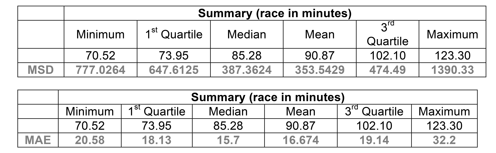
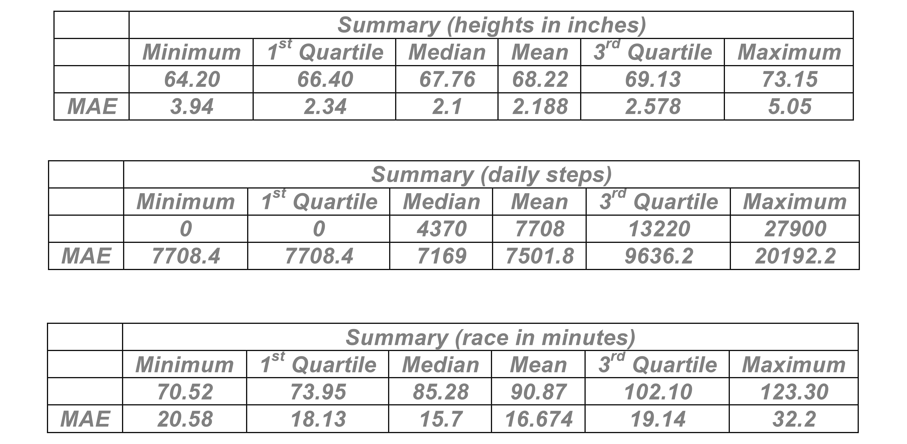

##***<u>Lesson 6: Statistical Predictions Applying the Rule</u>***

###**Objective:**
Students will apply the rule statisticians use to determine the best method for predicting heights for
students at a high school.

###**Materials:**
1. Each team’s rule for determining a winner (from previous lesson)

2. *Prediction Games* handout ([LMR_4.5_Prediction Games](../IDS_Curriculum_v_5.0/2_IDS_LMRs_v_5.0/IDS_LMR_Unit 4_v_5.0/LMR_4.5_Prediction Games.pdf))

###**Vocabulary:**
mean squared deviation, mean absolute error

###**Essential Concepts:**

!!! note "Essential Concepts: " 
    If we use the squared residuals rule, then the mean of our current data is the best
    prediction of future values. If we use the mean absolute error rule, then the median of the current data is the
    best prediction of future values

###**Lesson:**
1. Ask students to recall that in the previous lesson, each student team created a rule to determine
a winner. Which team’s rules worked well for determining a winner?

2. Remind them that in their DS Journals, they took notes about each team’s rule as they presented.
This time, they will be switching roles – instead of creating a rule to judge the given predictions,
they will be given a rule and it’s their job to find the best procedure to win the contest.

3. Inform students that the question we are trying to answer is:

    **How can we create a general rule that will always select the BEST guess to win no matter
    what 10 data points we are given?**

4. Explain to students that data scientists use the “mean squared deviation” rule (also called the
“mean squared error” or “mean squared residual” rule or “residual sums of squares” rule, the
latter term being the most common). A “*deviation*” is the difference between our prediction and
the actual outcome (as in MAD) and is sometimes called a “residual.”

    **<u>Note to Teacher:</u>** Basically, students are being asked to determine which of these predicted
    values is "closest" to the data. One issue that comes up is dealing with positive and negative
    differences.

5. Distribute the *Prediction Games* handout ([LMR_4.5](../IDS_Curriculum_v_5.0/2_IDS_LMRs_v_5.0/IDS_LMR_Unit 4_v_5.0/LMR_4.5_Prediction Games.pdf)).

<iframe src="https://docs.google.com/viewerng/viewer?url=https://curriculum.idsucla.org/IDS_Curriculum_v_5.0_preview/2_IDS_LMRs_v_5.0/IDS_LMR_Unit 4_v_5.0/LMR_4.5_Prediction Games.pdf&embedded=true" style=" width:420px;height:400px;" frameborder="0"></iframe> [LMR_4.5](../IDS_Curriculum_v_5.0/2_IDS_LMRs_v_5.0/IDS_LMR_Unit 4_v_5.0/LMR_4.5_Prediction Games.pdf)

6. Explain the rules of the game as follows:

    You are allowed to use just one value for each game, and your value should be based on the
    data. The **mean squared deviation** rule says: Your score is determined by finding the average of
    the squared differences between your guess and the actual values. The winner is the team with
    the lowest mean squared deviation. For each of the games below, try the provided statistics and
    determine which one works best.

    

    100. <u>Game 1:</u> Predict the heights of 10 randomly chosen people. **<u>Remember:</u>** You must choose
    just one statistic to use as a prediction from this list:

        

        Outcomes: here are the actual heights that were selected – 66, 67, 73, 68, 68, 73, 69, 64, 66,
        67. Which of these numbers did best? Compare your score using the mean squared
        deviations.

        ***For example, using the minimum and outcomes above, gives you a mean squared
        deviation of:***

        

        ***Note to teacher: The value of the mean squared deviation will always be in square
        units. In order to convert back to the original units, simply take the square root of the
        mean squared deviation.***

        ***Interpretation: When using the minimum height to make predictions about all heights,
        our predictions will typically be off by  inches.***    

    100. <u>Game 2:</u> Predict the number of steps, as counted by a FitBit, this person will take in the future.
    Choose your prediction from these values:

        

        Outcomes: here are the actual daily steps that this person took – 0, 27903, 6044, 0, 0, 17436,
        2697, 14944, 8060, 0. Which of these numbers did best? Compare your score using the
        mean squared deviations.

        **Note to teacher:** For Game 2, you might consider allowing students to utilize RStudio to
        calculate the mean squared deviation. The example below can be used to calculate the mean
        squared deviation for predicting daily steps using the minimum. Before revealing the codes,
        elicit a class discussion about how RStudio can be used to calculate the MSD.

        Step 1: Create a vector of the given daily steps

        **> steps<-c(0,27903,6044,0,0,17436,2697,14944,8060,0)**

        Step 2: Store the squared deviations

        **> sqr_dev<-((steps-0)^2)**

        Step 3: Find the mean of the squared deviations

        **> mean(sqr_dev)**

        The code can be shortened to two steps if you apply a composition of the last two functions

        **> mean((steps-0)^2)**

    100. <u>Game 3:</u> Predict the number of minutes it took 10 randomly selected teenagers to run the
    Cherry Blossom 10 Mile Race in Washington, D.C.

        
        
        Outcomes: here are the actual race times of the teenagers – 74, 123, 121, 103, 75, 72, 85,
        71, 86, 101. Which of these numbers did best? Compare your score using the mean squared
        deviations.

7. Using the mean squared deviations, which statistic is the winner and which statistics placed
second and third? Discuss which statistic made the best predictions in all three games.

    **<u>Note to teacher:</u>** Explain that the mean worked best for all three contests. Data scientists (and
    mathematicians) can prove that the mean will **always** work best (except in a few weird cases
    from time to time). So if you want to predict the future, the mean is the best single guess you can
    make.

8. Ask: What if another data science class has a best rule that is different from ours?

9. Another agreed upon method that data scientists and statisticians often use is the **mean
absolute error**. It’s unlikely that students will figure this out on their own. The reasons why we do
it in statistics date back to the 18th century, so it won't make a lot of sense; but it’s what
statisticians do. The mean absolute error is expressed as:

    

    where x̂ stands for the predicted value.

10. Explain that each team will now use the statisticians’ method for declaring a winner. Display the
mean absolute error formula and discuss what each symbol means.

11. Using our previous examples, recalculate your predictions using the MAE.

12. Using the mean absolute error, which statistic is the winner and which statistics placed second
and third?

    ***Answers:***

    

    **<u>Note to teacher:</u>** Explain that in this instance, the median is the “winner.” This means that the
    way you play the game depends on the rules of the game. If we used squared deviations, play
    with the mean. If we use the mean absolute error (MAE), play with the median.

###**Class Scribes:**
One team of students will give a brief talk to discuss what they think the 3 most important topics of the
day were.