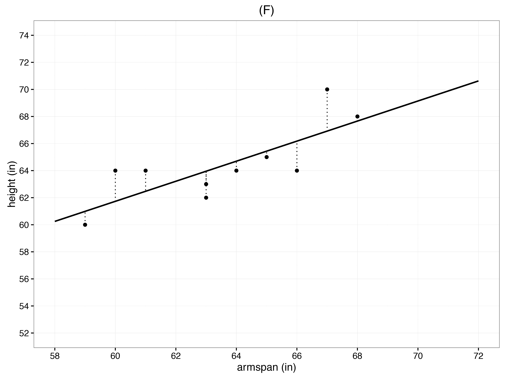

##***<u>Lesson 9: The Spaghetti Line</u>***

###**Objective:**
Students will estimate the line of best fit for a height and arm span data set using a strand of spaghetti as
a modeling tool.

###**Materials:**
1. *The Spaghetti Line* ([LMR_4.9_The Spaghetti Line](../IDS_Curriculum_v_5.0/2_IDS_LMRs_v_5.0/IDS_LMR_Unit 4_v_5.0/LMR_4.9_The Spaghetti Line.pdf))

    **<u>Note:</u>** Advance preparation is required. Cut out plots prior to beginning the lesson.

2. *What’s the Trend?* ([LMR_4.7_What’s the Trend](../IDS_Curriculum_v_5.0/2_IDS_LMRs_v_5.0/IDS_LMR_Unit 4_v_5.0/LMR_4.7_What’s the Trend.pdf)) from [lesson 8](lesson8.md)

3. *Arm Span vs. Height Scatterplot* ([LMR_4.6_Arm Span vs Height](../IDS_Curriculum_v_5.0/2_IDS_LMRs_v_5.0/IDS_LMR_Unit 4_v_5.0/LMR_4.6_Arm Span vs Height.pdf)) from [Lesson 7](lesson7.md)

4. 1 lb. of Uncooked Spaghetti

5. Grid Paper

6. Tape or Glue

7. Poster paper

###**Vocabulary:**
line of best fit, regression line

###**Essential Concepts:**

!!! note "Essential Concepts: "
    We can often use a straight line to summarize a trend. “Eye balling” a straight line to a
    scatterplot is one way to do this.

###**Lesson:**
1. If necessary, begin by sharing out the descriptions for the plots in the *Strength of Association*
([LMR_4.8_Strength of Association](../IDS_Curriculum_v_5.0/2_IDS_LMRs_v_5.0/IDS_LMR_Unit 4_v_5.0/LMR_4.8_Strength of Association.pdf)) handout from the previous lesson.

2. Inform students that in this lesson, they will estimate the equation of the **line of best fit** for a
height and arm span data set.

3. Refer students back to the plots in the *What’s the Trend?* handout ([LMR_4.7_What’s the Trend](../IDS_Curriculum_v_5.0/2_IDS_LMRs_v_5.0/IDS_LMR_Unit 4_v_5.0/LMR_4.7_What’s the Trend.pdf)).
The line in each of the plots is known as the **line of best fit**, or the **regression line**. This is a
trend line that best represents or models the data in each scatterplot. Ask students:

    100. *Why do you think this line is called “best fit”? **Some possible answers are that it is a
    line that is closest to all data points or that it “fits” evenly among the data points.
    This is a good time to refer back to the discussion about height versus arm span in
    [lesson 7](lesson7.md).***

4. Distribute *The Spaghetti Line* ([LMR_4.9_The Spaghetti Line](../IDS_Curriculum_v_5.0/2_IDS_LMRs_v_5.0/IDS_LMR_Unit 4_v_5.0/LMR_4.9_The Spaghetti Line.pdf)) to each student and a couple of
spaghetti strands per team. Students will estimate the line of best fit as outlined in the handout.
Team solutions should be recorded on poster paper. They will glue their assigned plot on the
poster and record their responses to the questions on the poster paper.

    **<u>Note to teacher:</u>** If necessary, review how to find the slope of a line using two points and how to
    write an equation using the slope and y-intercept.

    
<iframe src="https://docs.google.com/viewerng/viewer?url=https://curriculum.idsucla.org/IDS_Curriculum_v_5.0_preview/2_IDS_LMRs_v_5.0/IDS_LMR_Unit 4_v_5.0/LMR_4.9_The Spaghetti Line.pdf&embedded=true" style=" width:420px;height:400px;" frameborder="0"></iframe> [LMR_4.9_The Spaghetti Line](../IDS_Curriculum_v_5.0/2_IDS_LMRs_v_5.0/IDS_LMR_Unit 4_v_5.0/LMR_4.9_The Spaghetti Line.pdf)
    

5. Ask teams to post their work around the room. Conduct a *Gallery Walk* so that teams can see
each other’s work.

6. Lead a discussion about the teams’ lines. Ask: Which team has the best line? Why?

    **<u>Note to teacher:</u>** Push the students a bit by adding an obviously bad line to the graph and asking
    why their line is better than this one. Push them to come to an understanding that the “best” line
    comes close to the *most* points.

7. Inform students that data scientists have a way of finding the best line. They choose the line so
that the mean squared distances between the points and the line is as small as possible. Discuss
with students:

    100. What methods have we used so far? ***We’ve used Mean Squared Deviations and Mean
    Absolute Error ([Lesson 6](lesson6.md)).***

    100. How did we use these methods? ***It was best to use Mean Squared Deviations when
    we are looking at mean and Mean Absolute Error when we are looking at median.***

    100. Which method do you think data scientists use most often? ***Data scientists often use
    MAE.***

8. [See graphic below] If time permits, ask students to calculate the distances and squares of two
different lines so that they can understand what it means. This is the 2D version of the game they
played in [Lesson 6](lesson6.md).

9. Inform students that they will see the equation of the arm span vs. height data in [lesson 10](lesson10.md).

###**Class Scribes:**
One team of students will give a brief talk to discuss what they think the 3 most important topics of the
day were.

###
**Homework & Next Day**

Students will use a straight edge to draw a line of best fit for the scatter plot in the *Arm Span vs. Height*
handout ([LMR_4.6_Arm Span vs Height](../IDS_Curriculum_v_5.0/2_IDS_LMRs_v_5.0/IDS_LMR_Unit 4_v_5.0/LMR_4.6_Arm Span vs Height.pdf)) from [lesson 5](lesson5.md). They will use their knowledge of slope and y-intercept
to determine the equation for the line of best fit that they drew.

[<u>***LAB 4C: Cross-Validation***</u>](lab4c.md)

Complete [Lab 4C](lab4c.md) prior to [Lesson 10](lesson10.md).